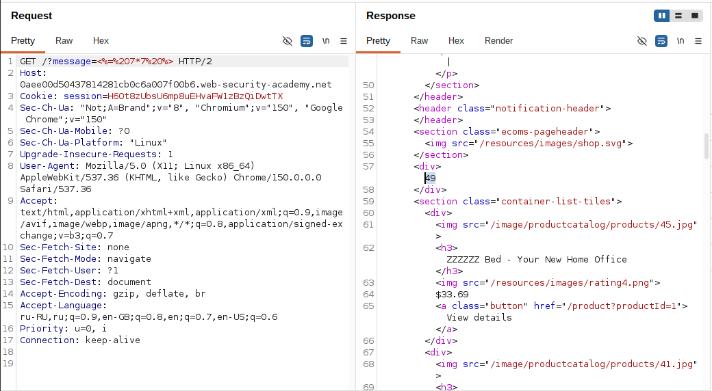
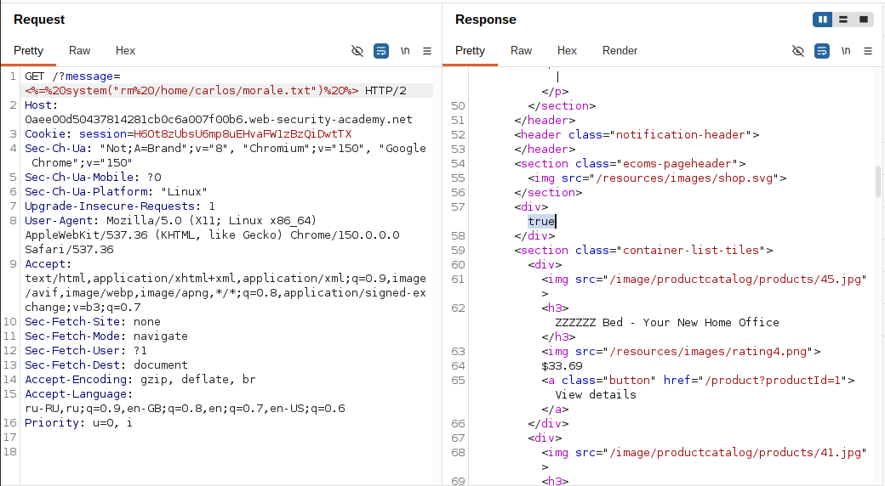

# Lab: Basic server-side template injection

**Платформа:** PortSwigger Web Security Academy
**Категория:** Server-Side Template Injection (SSTI)
**Сложность:** Practitioner
**Дата:** 2026-08-07

## TL;DR

Приложение уязвимо для внедрения шаблонов на стороне сервера (SSTI) из-за небезопасного создания шаблона ERB (Embedded Ruby). Пользовательский ввод из параметра `message` вставляется непосредственно в шаблон до его компиляции, что позволяет выполнить произвольный Ruby-код. Используя метод `system()`, удалось выполнить команду ОС и удалить файл `morale.txt` из домашнего каталога пользователя `carlos`.

---

## Описание уязвимости

Приложение отражает значение параметра `message` на главной странице, отображая сообщение `"Unfortunately this product is out of stock"`, когда пользователь пытается посмотреть подробности товара, которого нет в наличии.

Проблема в том, что значение параметра не просто подставляется как текст в HTML, а передаётся напрямую в шаблонизатор ERB и обрабатывается как **часть шаблона**, а не как данные. Из-за этого любой валидный синтаксис ERB, попавший в параметр, будет выполнен на сервере.

Разработчик, по всей видимости, реализовал что-то вроде:

```ruby
template = "...<div>#{params[:message]}</div>..."
ERB.new(template).result
```

Здесь пользовательский ввод оказывается встроен в шаблон до его компиляции, а не подставлен безопасным способом как данные.

---

## Разведка

### Шаг 1 — Поиск точки ввода

При попытке просмотреть подробную информацию о товаре, которого нет в наличии, запрос `GET` использует параметр `message` для отображения сообщения на главной странице:

```
/?message=Unfortunately+this+product+is+out+of+stock
```

Это указывает на потенциальную точку для инъекции, поскольку значение параметра отражается в ответе приложения.

### Шаг 2 — Проверка гипотезы: шаблонизатор ERB

Согласно описанию лаборатории, серверная сторона использует ERB. Синтаксис ERB:

- `<%= выражение %>` — вычисляет выражение и **выводит результат** в HTML;
- `<% код %>` — выполняет код, но ничего не выводит.

Была сформирована тестовая полезная нагрузка с математической операцией:

```erb
<%= 7*7 %>
```

Полезная нагрузка была закодирована в URL и подставлена в качестве значения параметра `message`:

```
https://YOUR-LAB-ID.web-security-academy.net/?message=<%25%3d+7*7+%25>
```

где:

- `%25` — закодированный символ `%`
- `%3d` — закодированный символ `=`
- `+` — закодированный пробел

**Результат:** вместо исходного сообщения на странице отобразилось число `49` — результат вычисления `7*7`. Это подтвердило, что сервер выполняет содержимое параметра `message` как код шаблона ERB, а значит, приложение уязвимо для SSTI.



---

## Эксплуатация

### Шаг 3 — Поиск способа выполнения команд ОС

В документации Ruby был найден метод `system()`, позволяющий выполнять произвольные команды операционной системы из кода Ruby и, соответственно, из шаблона ERB.

### Шаг 4 — Формирование полезной нагрузки

Была сформирована полезная нагрузка для удаления файла из домашнего каталога пользователя `carlos`:

```erb
<%= system("rm /home/carlos/morale.txt") %>
```

### Шаг 5 — Кодирование и отправка запроса

Полезная нагрузка была закодирована в URL и подставлена в качестве значения параметра `message`:

```
https://YOUR-LAB-ID.web-security-academy.net/?message=<%25+system("rm+/home/carlos/morale.txt")+%25>
```

Запрос был отправлен через браузер (альтернативно — через Burp Suite Repeater).



### Шаг 6 — Подтверждение эксплуатации

После отправки запроса сервер выполнил переданную Ruby-команду `system("rm /home/carlos/morale.txt")`, что привело к удалению файла `morale.txt` из домашнего каталога `carlos`. Лаборатория была отмечена как решённая (статус "Solved").

---

## Итог

Приложение оказалось уязвимо к SSTI из-за небезопасной конкатенации пользовательского ввода в шаблон ERB перед его рендерингом. Возможность вычисления произвольных Ruby-выражений через `<%= %>` позволила перейти от простого раскрытия факта уязвимости (математическая операция) к выполнению произвольных команд операционной системы через `system()`, что привело к полной компрометации файловой системы сервера в контексте процесса приложения.

---

## Защита

Для предотвращения подобных атак необходимо:

- не встраивать пользовательский ввод напрямую в шаблон до его компиляции;
- использовать шаблонизатор в режиме "logic-less" или с ограниченным контекстом выполнения, где пользовательские данные передаются только как значения переменных, а не как часть исходного кода шаблона;
- по возможности избегать динамической компиляции шаблонов из данных, контролируемых пользователем;
- применять принцип наименьших привилегий для процесса, исполняющего шаблонизатор, чтобы ограничить последствия выполнения произвольного кода;
- использовать песочницы (sandboxing) для рендеринга шаблонов, если динамическая компиляция неизбежна;
- регулярно проводить аудит кода на предмет небезопасного использования `ERB.new()`, `eval()` и аналогичных конструкций.
