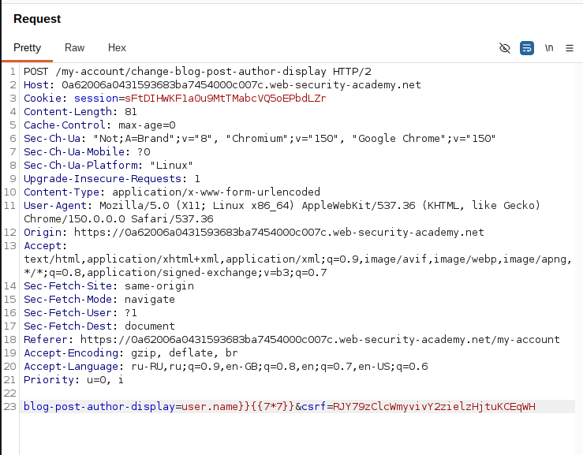
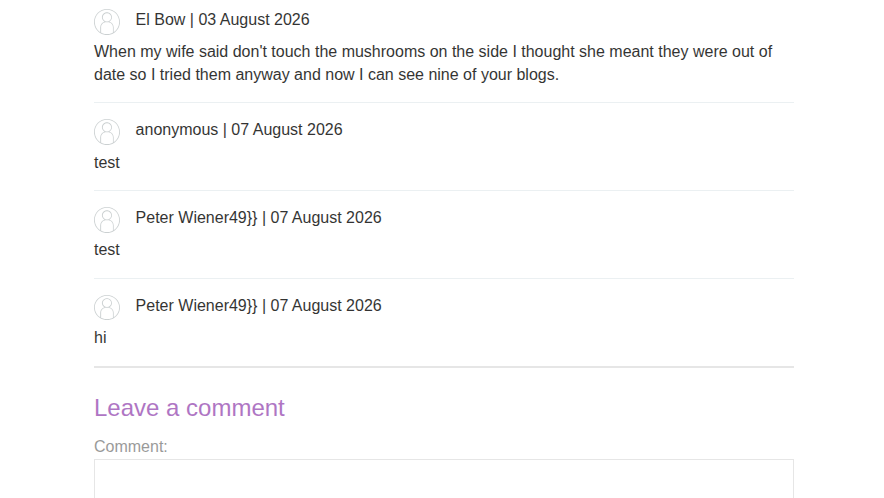
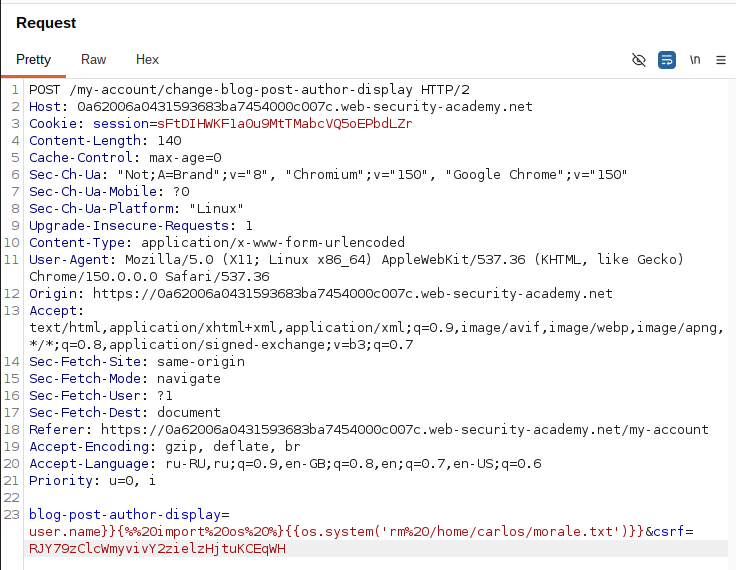
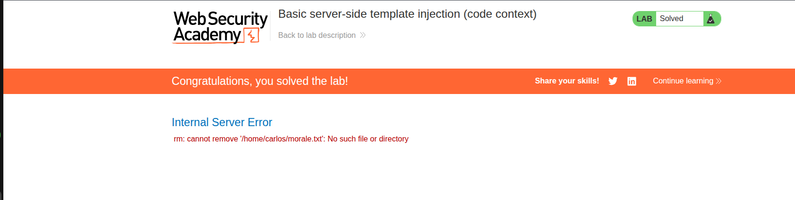

# Lab: Basic server-side template injection (code context)

**Платформа:** PortSwigger Web Security Academy
**Категория:** Server-Side Template Injection (SSTI)
**Сложность:** Practitioner
**Дата:** 2026-08-07

## TL;DR

Приложение уязвимо для внедрения шаблонов на стороне сервера (SSTI) из-за небезопасного использования шаблонизатора Tornado. Значение параметра `blog-post-author-display`, отвечающего за выбор отображаемого имени пользователя, подставляется непосредственно внутрь уже существующего выражения шаблона `{{ user.name }}`. Выйдя за пределы этого выражения, удалось внедрить произвольный код шаблона Tornado и с помощью модуля `os` выполнить команду ОС, удалив файл `morale.txt` из домашнего каталога пользователя `carlos`.

---

## Описание уязвимости

В отличие от классического SSTI, где пользовательский ввод целиком становится содержимым шаблонного выражения, здесь инъекция происходит **в контексте кода**: пользовательский ввод подставляется внутрь уже существующего выражения `{{ user.name }}`, а не в чистый текст страницы.

Приложение позволяет пользователю выбрать, какое имя отображать рядом с его комментариями в блоге (полное имя, имя или никнейм). Выбор передаётся через POST-запрос, а значение параметра, судя по всему, подставляется в шаблон Tornado примерно так:

```python
template.generate(display_name="{{ " + user_choice + " }}")
```

Поскольку сервер не валидирует и не экранирует значение параметра `blog-post-author-display`, а просто встраивает его в код шаблона, значение можно использовать для того, чтобы «закрыть» текущее выражение и внедрить собственный шаблонный код.

---

## Разведка

### Шаг 1 — Изучение функции выбора отображаемого имени

Прокси-трафик пропущен через Burp Suite. После входа в систему (`wiener:peter`) был оставлен комментарий к одному из постов блога.

На странице **My account** обнаружена функция выбора отображаемого имени: полное имя, имя (first name) или никнейм. При подтверждении выбора отправляется POST-запрос:

```
POST /my-account/change-blog-post-author-display
```

Параметр `blog-post-author-display` устанавливается в одно из значений: `user.name`, `user.first_name` или `user.nickname`. При загрузке страницы с оставленным комментарием отображаемое имя над комментарием меняется в зависимости от текущего значения этого параметра.

Соответствующий запрос был найден в **Proxy > HTTP history** и отправлен в **Burp Repeater** для дальнейшей работы.

### Шаг 2 — Проверка гипотезы: шаблонизатор Tornado

Согласно документации Tornado, шаблонные выражения заключаются в двойные фигурные скобки:

```
{{ someExpression }}
```

Так как значение параметра, судя по всему, подставляется внутрь уже существующего выражения `{{ user.name }}`, была предпринята попытка «выйти» за его пределы и внедрить собственное выражение:

```
blog-post-author-display=user.name}}{{7*7}}
```

Идея в том, что итоговый шаблон соберётся примерно так:

```
{{ user.name}}{{7*7}} }}
```

где первая часть выводит имя пользователя, вторая — результат вычисления `7*7`, а лишняя закрывающая пара `}}` в конце отображается как обычный текст.



### Шаг 3 — Подтверждение SSTI

Запрос был отправлен через Burp Repeater, после чего была перезагружена страница блога с тестовым комментарием.

**Результат:** вместо имени пользователя отобразилось:

```
Peter Wiener49}}
```

Число `49` — результат вычисления `7*7` — подтвердило, что пользовательский ввод действительно выполняется как код шаблона Tornado, а значит, приложение уязвимо для SSTI в контексте кода.



---

## Эксплуатация

### Шаг 4 — Поиск способа выполнения произвольного Python-кода

В документации Tornado обнаружен синтаксис для выполнения произвольного Python-кода (в отличие от `{{ }}`, который только вычисляет и выводит выражение):

```

```

В документации Python найден способ выполнения системных команд — через импорт модуля `os` и вызов метода `os.system()`.

### Шаг 5 — Формирование полезной нагрузки

Составлена полезная нагрузка, объединяющая выход из текущего выражения, импорт модуля `os` и вызов команды для удаления файла:

```
user.name}}{{os.system('rm /home/carlos/morale.txt') }}
```



### Шаг 6 — Кодирование и отправка запроса

В Burp Repeater был подготовлен запрос `POST /my-account/change-blog-post-author-display` со следующим телом (значение параметра закодировано в URL — пробелы заменены на `+`/`%20`, символ `%` закодирован как `%25`):

```
blog-post-author-display=user.name}}{%25+import+os+%25}{{os.system('rm%20/home/carlos/morale.txt')+}}
```

Запрос был отправлен.

### Шаг 7 — Подтверждение эксплуатации

После перезагрузки страницы блога с комментарием шаблон был отрендерен сервером, что привело к выполнению внедрённого Python-кода: модуль `os` был импортирован, а команда `os.system('rm /home/carlos/morale.txt')` — выполнена. Файл `morale.txt` был удалён из домашнего каталога `carlos`. Лаборатория была отмечена как решённая (статус "Solved").

## 

## Итог

Приложение оказалось уязвимо к SSTI в контексте кода: пользовательский ввод подставлялся не в чистый текст, а внутрь уже существующего шаблонного выражения `{{ user.name }}`. Это потребовало дополнительного шага — выхода за пределы существующего выражения закрывающими скобками `}}` перед внедрением собственного синтаксиса Tornado. Далее эксплуатация свелась к стандартной схеме SSTI: подтверждение уязвимости через математическую операцию (`7*7`), затем переход к выполнению произвольного кода через блок ``, импорт модуля `os` и вызов `os.system()` для выполнения команды в операционной системе сервера.

---

## Защита

Для предотвращения подобных атак необходимо:

- никогда не подставлять пользовательский ввод внутрь синтаксиса шаблона (ни в текст, ни, тем более, внутрь уже существующих выражений);
- передавать пользовательские данные в шаблон только через контекст переменных (например, `template.generate(user_choice=user_choice)`), а не через конкатенацию строк с кодом шаблона;
- использовать строгую валидацию/белые списки допустимых значений для параметров, влияющих на логику отображения (в данном случае — ограничить `blog-post-author-display` набором `name`, `first_name`, `nickname` без возможности передать произвольную строку);
- по возможности использовать «logic-less» шаблонизаторы или запускать рендеринг шаблонов в изолированной песочнице (sandboxing);
- проводить аудит кода на предмет динамической сборки шаблонов из пользовательского ввода.
