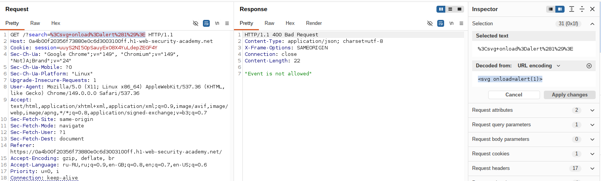
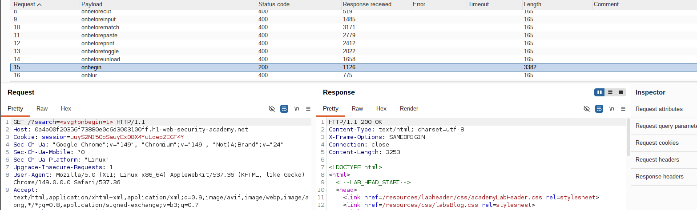
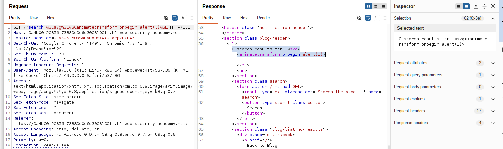
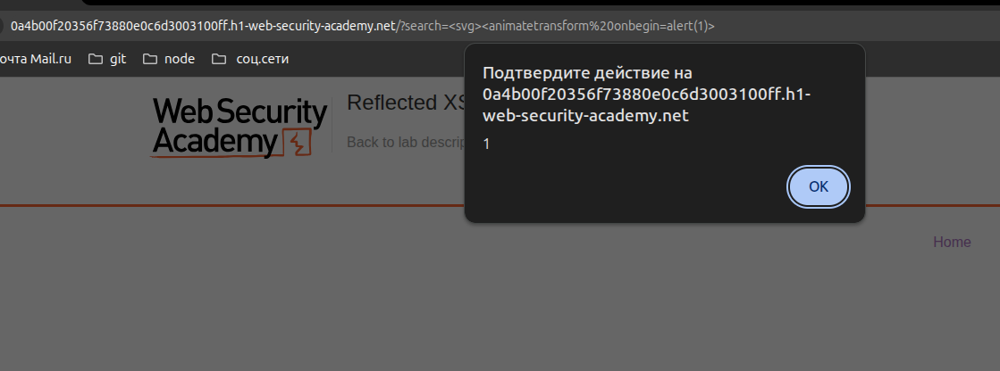

# Lab: Reflected XSS with some SVG markup allowed

**Платформа:** PortSwigger Web Security Academy  
**Категория:** Cross-Site Scripting (XSS)  
**Сложность:** Practitioner  
**Дата:** 2025-07-07

## TL;DR

Приложение содержит уязвимость отраженного XSS. Фильтрация блокирует распространенные HTML-теги и события, но разрешает некоторые SVG-элементы. Используя SVG-тег `animatetransform` и событие `onbegin`, удалось выполнить JavaScript-код через функцию `alert()`. 

---

## Описание уязвимости

Приложение отражает пользовательский ввод из параметра поиска непосредственно в HTML-код страницы.

Для защиты используется фильтрация HTML-тегов и событий JavaScript. Однако фильтр реализован некорректно и допускает использование некоторых элементов SVG.

Так как SVG поддерживает собственные события, которые могут выполнять JavaScript-код, можно обойти ограничение фильтра и выполнить XSS-атаку.

---
## Разведка

В приложении присутствует функция поиска, значение которой отражается обратно на странице.

Так как в описании лаборатории указано, что приложение разрешает некоторые SVG-теги и события, была проверена SVG-разметка.

Первый тест:

```html
<svg onload=alert(1)>
```

Результат:

```
Event is not allowed
```

Это показало:

- тег `<svg>` разрешен приложением;
- событие `onload` блокируется фильтром.

Следовательно, необходимо найти другое SVG-событие, которое не будет запрещено фильтрацией.

---

Для поиска разрешенных событий был использован **Burp Suite Intruder**.

В качестве точки для перебора было выбрано значение обработчика события внутри SVG-тега:

```html
<svg EVENT=alert(1)>
```

В качестве payload были использованы различные SVG event handlers.

Intruder позволил автоматически проверить, какие события блокируются фильтром, а какие проходят обработку приложением.

В результате перебора было обнаружено, что большинство событий возвращают ошибку фильтрации:

```
Event is not allowed
```

Однако событие `onbegin` было разрешено приложением и возвращало успешный ответ.


---

## Эксплуатация

### Шаг 1 — Проверка SVG-события

Так как приложение разрешает использование SVG-разметки, была проверена следующая payload:

```html
<svg onload=alert(1)>
```

Результат:

```
Event is not allowed
```

Вывод:

- тег `<svg>` разрешен приложением;
- событие `onload` блокируется фильтром.

Следовательно, необходимо найти другое SVG-событие, которое будет разрешено фильтром.



---

### Шаг 2 — Поиск разрешенных SVG-событий

Для поиска подходящего события был использован **Burp Suite Intruder**.

В качестве точки перебора использовалось значение обработчика события:

```html
<svg EVENT=alert(1)>
```

Был выполнен перебор различных SVG event handlers для определения того, какие события разрешены фильтром приложения.

Большинство событий возвращали ошибку:

```
Event is not allowed
```

Однако событие `onbegin` прошло проверку и не было заблокировано.



---

### Шаг 3 — Формирование финальной payload

Событие `onbegin` предназначено для SVG-анимаций, поэтому его нельзя использовать напрямую на элементе `<svg>`.

Для запуска события был добавлен SVG-элемент анимации `animatetransform`.

Финальная payload:

```html
<svg><animatetransform onbegin=alert(1)>
```

После отправки payload приложение отразило её в HTML-коде страницы.



---

### Шаг 4 — Выполнение JavaScript

При загрузке страницы браузер запускает SVG-анимацию и вызывает событие `onbegin`.

В результате выполняется JavaScript-код:

```javascript
alert(1)
```

Появление окна `alert()` подтверждает успешную эксплуатацию отраженного XSS.



## Итог

Удалось выполнить отраженную XSS-атаку через разрешенную SVG-разметку.

Несмотря на наличие фильтрации HTML-событий, приложение не учитывает особенности SVG и допускает выполнение JavaScript через событие `onbegin` элемента `animatetransform`.

---

## Защита

Для предотвращения подобных атак необходимо:

- не вставлять пользовательский ввод напрямую в HTML-код страницы;
- использовать контекстное экранирование пользовательских данных;
- применять безопасные методы генерации HTML;
- не использовать собственные слабые фильтры для защиты от XSS;
- использовать Content Security Policy (CSP) как дополнительный уровень защиты.