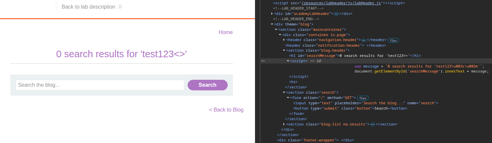
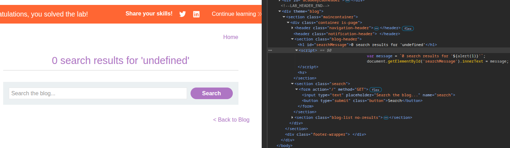
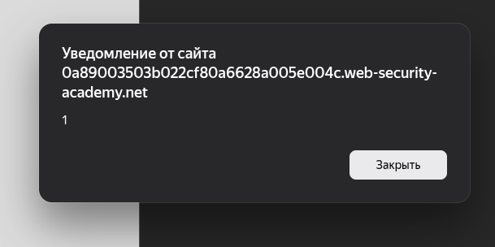

## Lab: Reflected XSS into a template literal with angle brackets, single, double quotes, backslash and backticks Unicode-escaped
**Платформа:** PortSwigger Web Security Academy  
**Категория:** Cross-Site Scripting (XSS) 
**Сложность:** Practitioner  
**Дата:** 2025-07-09  

---

## TL;DR
Ввод отражается внутри JavaScript template literal (строка в обратных
кавычках). Все спецсимволы экранированы, но синтаксис `${...}`
интерпретируется внутри template literal без каких-либо ограничений —
`${alert(1)}` выполняется напрямую.

---

## Описание уязвимости
Template literal — особый тип строки в JavaScript, обёрнутый
в обратные кавычки. Внутри него `${выражение}` вычисляется
и вставляется в строку автоматически:

```javascript
// Обычная строка:
var a = 'Привет, ' + name;

// Template literal:
var a = `Привет, ${name}`;
// ${} — вычисляет любое JS-выражение
```

Если пользовательский ввод попадает внутрь template literal
без экранирования `${` — атакующий может выполнить произвольный JS.

---

## Разведка

### Шаг 1 — Находим точку отражения
Ввела случайную строку `abc123` в поиск.
Открыла DevTools (F12 → Sources), нашла где ввод отражается:

```javascript
var searchQuery = `Вы искали: abc123`;
```

Ввод попал внутрь template literal.



### Шаг 2 — Проверяем экранирование
Попробовала стандартные символы:

```
< > → HTML-кодированы
' " → HTML-кодированы
\   → экранирован
`   → экранирован
```

Все очевидные способы выйти из строки заблокированы.
Но `${` не фильтруется — это и есть уязвимость.

---

## Эксплуатация

### Финальный payload
```
${alert(1)}
```

Что получается в коде после подстановки:

```javascript
var searchQuery = `Вы искали: ${alert(1)}`;
```

Браузер вычисляет `${alert(1)}` как JS-выражение →
вызывается `alert(1)`.



### Результат
При открытии страницы с payload в поисковом запросе
сработал `alert(1)`.



---

## Почему сработало

```
Обычная строка:      'текст'   — ' можно экранировать через \'
Template literal:    `текст`   — ` экранирован, выйти нельзя

Но внутри template literal:
${выражение} — вычисляется ВСЕГДА
Экранирование ' " < > \ ` не имеет значения —
${} работает без выхода из строки вообще
```

---

## Сравнение с предыдущей лабой

| | JS String (`'`) | Template Literal (`` ` ``) |
|---|---|---|
| Выход из строки | `\'` → нейтрализуем `\` | Не нужен |
| Payload | `\'-alert(1)//` | `${alert(1)}` |
| Почему работает | `\` не экранирован | `${}` не фильтруется |

---

## Итог
Template literal вычисляет `${}` как JS-код независимо от
экранирования кавычек и скобок. Фильтр защищал от выхода
из строки — но не от выполнения кода внутри неё.

---

## Защита

```javascript
// Плохо — вставка ввода напрямую в template literal:
var query = `Вы искали: ${userInput}`;

// Хорошо — экранировать перед вставкой:
var safe = userInput
  .replace(/&/g, '&')
  .replace(//g, '>')
  .replace(/\$/g, '$')  // ← блокирует синтаксис ${}
  .replace(/`/g, '`');

var query = `Вы искали: ${safe}`;

// Лучше — не вставлять пользовательский ввод в JS вообще:
// Использовать textContent для отображения:
document.getElementById('result').textContent = userInput;
```