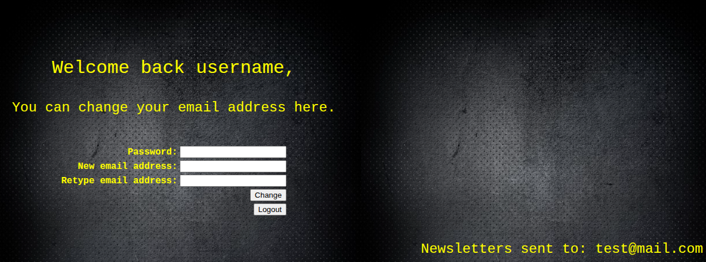
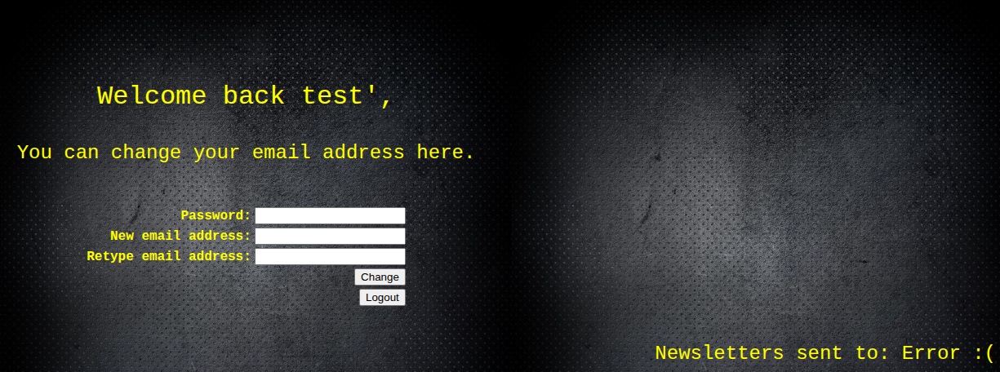
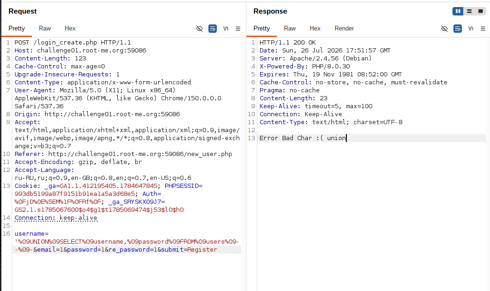
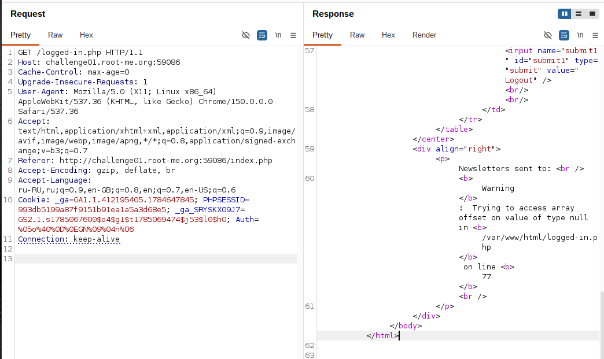
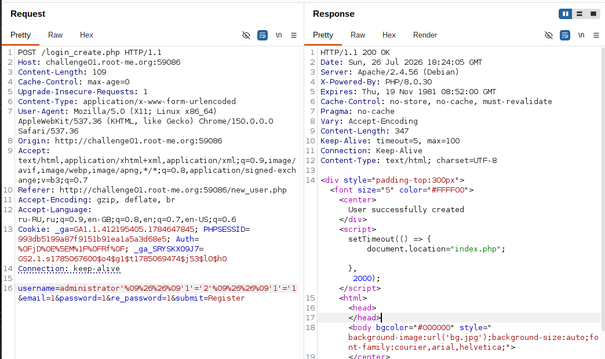
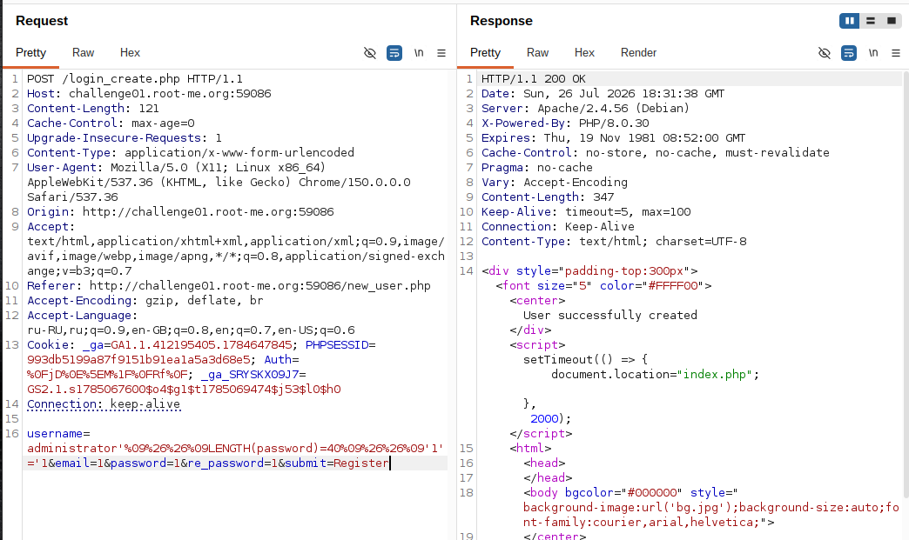
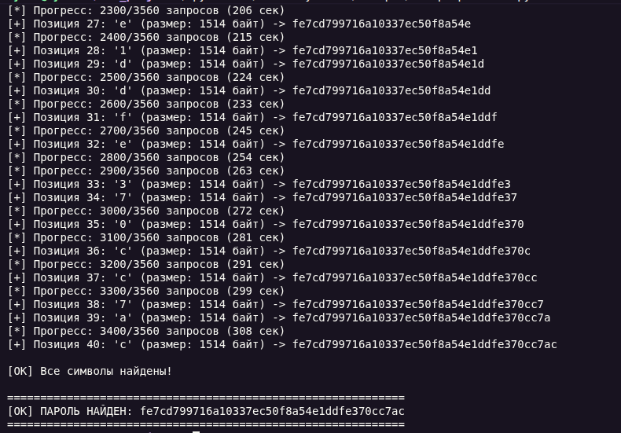
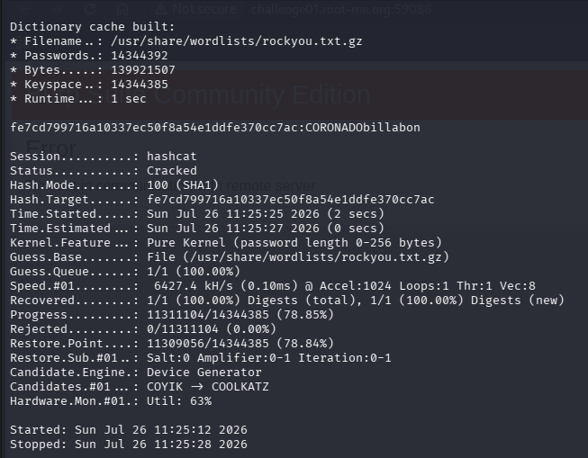
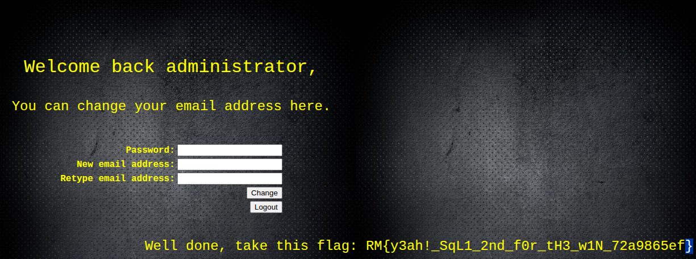

## Lab: SQL Injection - Second Order

**Платформа:** root-me.org
**Категория:** SQL Injection
**Сложность:** High
**Дата:** 2026-07-26

---

## TL;DR
Приложение позволяет пользователю задать произвольный `username` при регистрации (сохраняется безопасно, без разрыва синтаксиса). Позже, на странице `logged-in.php`, это значение повторно используется в новом SQL-запросе (`WHERE username='$username'`) без экранирования — классическая second-order инъекция. Фильтр слов (`union`, `select`, пробел, `/`) блокировал прямое чтение данных через `UNION`, поэтому эксплуатация строилась на boolean-based технике через сравнение размера ответа (`Content-Length`), а не через прямой вывод данных. Извлечён SHA1-хэш пароля пользователя `administrator`, который затем взломан офлайн через `hashcat` и словарь `rockyou.txt`.

## Теория: Second-Order SQL Injection

Second-order (инъекция второго порядка) отличается от классической (first-order) тем, что payload не срабатывает сразу в том же HTTP-запросе, где был отправлен, а **сохраняется** в базе данных через легитимную функцию (регистрация, обновление профиля) — на этом этапе он безопасен, потому что либо корректно экранируется, либо ещё не участвует в опасном запросе. Инъекция срабатывает **позже**, когда сохранённое значение **извлекается из БД и повторно используется** для построения другого SQL-запроса — уже без должной защиты.

```
Шаг 1 (сохранение):   payload → безопасно сохраняется в БД (параметризованный запрос)
Шаг 2 (использование): payload читается из БД → НЕБЕЗОПАСНО вставляется в другой запрос → инъекция срабатывает
```

Корневая причина — ошибка модели доверия: разработчик защищает первичную запись пользовательских данных, но неявно доверяет им при повторном чтении из БД, забывая, что это всё ещё недоверенные данные. Second-order инъекции плохо находятся автоматическими сканерами (sqlmap и подобные тестируют "запрос → ответ" в рамках одного HTTP-вызова) и требуют ручного анализа: где данные сохраняются и где ещё в приложении они переиспользуются.

## Разведка

### Шаг 1 - Точка сохранения и точка срабатывания

Точка сохранения: форма регистрации (`username`, `email`, `password`).
Точка срабатывания: страница `logged-in.php`, открывающаяся после входа — в шапке профиля выводится `Welcome back, username!`, а ниже — блок `Newsletters sent to: <email>`.



### Шаг 2 - Подтверждение second-order инъекции через username

Регистрация аккаунта с username `test'` привела к исключению на `logged-in.php`:
```
Error :(
```
Это подтвердило, что `username`, сохранённый при регистрации, **повторно используется** в SQL-запросе на странице `logged-in.php` без экранирования — второй запрос ломается из-за кавычки, добавленной при регистрации первого аккаунта.



### Шаг 3 - Обнаружение фильтра ключевых слов на поле username

Прямая попытка UNION-инъекции:
```
username: ' UNION SELECT username, password FROM users -- -
```
была заблокирована:
```
Error Bad Char :( union
```


Дальнейшее тестирование выявило полный список ограничений фильтра на этом поле:
- Блокируются (без учёта регистра): `union`, `select`, символ `/`.
- Блокируется обычный пробел (`+`, `%20`).
- Проходят: `AND`, `OR`, `FROM`, кавычка `'`, символ `%09` (табуляция) как замена пробела.

Double-writing bypass (`UNIONUNION`, `SELSELECTECT`) не сработал — фильтр проверяет **наличие подстроки** в тексте целиком, а не вырезает совпадение построчно, поэтому обход через повторение слова не проходит: `UNIONUNION` по-прежнему буквально содержит `union`.

Попытка stacked queries (`;`) также не сработала — простой `username: test';--` уже давал `Error :(`, то есть сам факт `;` ломает запрос: используемый драйвер БД не поддерживает multiple statements (в отличие от предыдущей лабы на PostgreSQL).

### Шаг 4 - Три состояния ответа как диагностический инструмент

Экспериментально установлены три различимых состояния страницы `logged-in.php` в зависимости от того, что происходит с SQL-запросом, использующим `username`:

| Состояние | Причина | Пример |
|---|---|---|
| `Error :(` | Синтаксическая ошибка SQL (перехвачено try/catch) | нечётное число незакрытых кавычек |
| `Warning: ...array offset...null` | Запрос синтаксически верный, но вернул 0 строк | `username` не существует |
| Показ данных без ошибки | Запрос верный и вернул ≥1 строку | `Newsletters sent to: admin@rootme.com` |




### Шаг 5 - Правило баланса кавычек (без экранирования на чтении)

Проверка через минимальные тесты (`probeA'`, `probeB''`, `probeC\'`, `probeD\`) показала, что на этой странице **нет** повторного прикладного экранирования (никакого `addslashes()` при чтении) — используется чистая конкатенация строки, и MySQL сам обрабатывает `\'` и `''` как валидное экранирование кавычки. Значит инъекция строится не через обход фильтрации экранирования, а через **правильный баланс количества кавычек**: любое условие, кроме самого последнего в цепочке `&&`, должно быть самозакрытым (`'X'='Y'`, 4 кавычки), иначе последующий оператор "проглатывается" внутрь незакрытой строки и перестаёт распознаваться как SQL-код.

---

## Эксплуатация

### Шаг 1 - Построение boolean-oracle без UNION/SELECT

Раз `UNION`/`SELECT` заблокированы фильтром, а исходный запрос уже сам по себе является `SELECT` — извлечение данных строится через модификацию условия `WHERE`, без необходимости в отдельном `SELECT`.

Базовый рабочий payload (кавычки — самозакрытые для промежуточных условий):
```
username: administrator'	&&	'1'='1'	&&	'1'='1
```
(`%09` вместо пробела, `%26%26` вместо `&&` при отправке через форму)




### Шаг 2 - Определение длины пароля

```
username: administrator'	&&	LENGTH(password)	=	40	&&	'1'='1
```
Перебором значений определена точная длина хранимого значения — **40 символов** (сразу указывает на SHA1-хэш, а не открытый пароль).



### Шаг 3 - Time-based оказался слишком шумным

Первая попытка automatievation строилась на измерении времени ответа (аналогично предыдущей лабе), однако сервер показывал нестабильные, "плавающие" задержки даже для заведомо истинных/ложных условий — вероятно, из-за нагрузки на shared challenge-сервер. Метод был заменён на **content-length based** boolean-инъекцию: сравнение размера HTML-ответа `logged-in.php` для заведомо истинного и ложного условия давало стабильную и воспроизводимую разницу (различный текст — email администратора против PHP Warning).


### Шаг 4 - Посимвольное извлечение хэша пароля

Для каждой из 40 позиций строки скрипт регистрировал отдельный аккаунт с условием:
```
SUBSTRING(password,{position},1)='{char}'
```
и сравнивал размер полученного `logged-in.php` с заранее определёнными `false_length`/`true_length`. Полный перебор дал значение поля `password`:

```
fe7cd799716a10337ec50f8a54e1ddfe370cc7ac
```

40 hex-символов — классическая сигнатура SHA1-хэша.



### Шаг 5 - Взлом хэша офлайн

Полученный хэш не подошёл для прямого входа (форма логина хэширует введённый текст ещё раз, поэтому нужен исходный пароль, а не хэш). Хэш взломан через `hashcat` со словарём `rockyou.txt`:

```bash
hashcat -m 100 -a 0 fe7cd799716a10337ec50f8a54e1ddfe370cc7ac /usr/share/wordlists/rockyou.txt.gz
```

Результат:
```
fe7cd799716a10337ec50f8a54e1ddfe370cc7ac:CORONADObillabon
```



### Шаг 6 - Вход в систему

```
username: administrator
password: CORONADObillabon
```

Успешный вход под учётной записью администратора, открывающий доступ к разделу с приватной рассылкой 0-day (согласно условию задания: *"You have access to a private mailing list that shares 0days. Try logging in as administrator"*).


---

## Вывод / причина уязвимости

- **Second-order SQL injection**: значение `username`, безопасно сохранённое при регистрации, повторно использовалось в другом SQL-запросе (`logged-in.php`) без параметризации.
- Фильтрация ключевых слов (`union`, `select`) и символов (`/`, пробел) была реализована на уровне текстового поиска подстроки, а не через параметризованные запросы — полностью обходится за счёт того, что исходный запрос уже содержит `SELECT`, и атакующему не нужно добавлять собственный.
- Отсутствие ограничения на количество строк в результате запроса (`LIMIT 1`) само по себе создавало наблюдаемую разницу в поведении (Error vs Warning vs данные) — что стало основой boolean-oracle.
- Пароль хранился в виде SHA1-хэша без соли (`Not-Salted` согласно выводу hashcat) — легко взламывается словарной атакой при недостаточной сложности исходного пароля.

## Защита

```php
// Параметризованный запрос вместо конкатенации — единственная надёжная защита:
$stmt = $db->prepare("SELECT email FROM users WHERE username = ?");
$stmt->bind_param("s", $username);
$stmt->execute();
```

Дополнительно:
- Применять параметризацию **везде**, где пользовательские данные (в том числе уже сохранённые в БД) подставляются в новый SQL-запрос — включая second-order сценарии, а не только первичный ввод.
- Не полагаться на фильтрацию ключевых слов (blacklist) как защиту от SQLi — она не устраняет уязвимость, только усложняет один конкретный вектор эксплуатации (UNION-based), оставляя boolean-based и другие техники рабочими.
- Хранить пароли через устойчивые к брутфорсу алгоритмы с солью (bcrypt, Argon2), а не через быстрый безсолевой хэш (SHA1/MD5).
- Ограничивать SQL-запросы явным `LIMIT` там, где ожидается ровно одна строка, и корректно обрабатывать случаи 0/много строк без падения в необработанные исключения, раскрывающие внутреннюю структуру приложения через сообщения об ошибках.